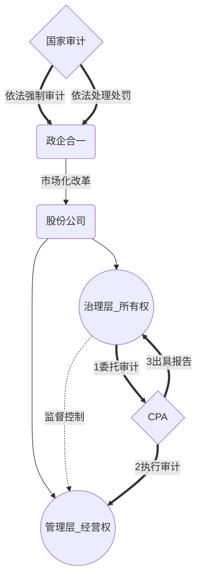

# 审计保证

## 审计历史

1. 时间：产生于19世纪~18..年~
2. 产生的动因：股份制公司出现（**所有权**<——>**经营权**)
3. 市场需求：两权分立，导致所有者对经营者的监控成为一种需求，**CPA**满足了这种需求。
4. CPA作用：  
   1. 会计信息对**资源配置**具有重要作用
   2. **管理层**是提供报表责任主体
   3. 利益驱动**容易失实**
   4. CPA**能够有效降低**失真风险，提高决策有效性，维护秩序，保护公众利益
5. 我国CPA发展

```mermaid
gantt
	dateFormat YYYY-MM--DD
	title 我国CPA发展示意图
	section A 
	~1978(计划经济无CPA):active,des1,34d
	1980~（市场经济，1980重建CPA）:active,des2,after des1,56d
	1980~2017（取得成就）:   des3,after des2,45d
	
```

1. **CPA促进**上市公司信息质量提高
2. **CPA维护**了市场经济秩序
3. **CPA推动**国企改革

## 审计？

> 财务报告审计：是指CPA对财务报表**是否不存在**重大错报提供的**合理保证**，以**积极方式**提出意见，增强**除管理层之外**的预期使用者对财报信赖程度

1. 审计用户是**财务报表预期使用者**

2. 审计目的是**改善财报质量或内涵，增加**预期使用者对财报信赖程度

   *（以合理保证方式提高财报可信度，而不涉及如何利用信息提供意见）*

3. **合理保证**是一种**高水平保证**

   *（**当**CPA获取==充分，适当==审计证据，将审计风险降至可接受低水平，**就**获得合理保证）*

4. 审计的基础是**独立性和专业性**

   *（审计==通常==有具备专业胜任能力和独立性的CPA来执行，CPA==应当==独立于**被审计单位**和**预期使用者**）*

5. 审计最终产品是**审计报告**

## 保证程度

|        | 合理保证                       | 有限保证                       |
| ------ | -------------------------- | -------------------------- |
| 目标     | 在**可接受低审计风险**下，以**积极方式**提供 | 在**可接受的审阅风险**下，以**消极方法**提供 |
| 证据收集程序 | 不断修正，系统化（==7中==）           | 不断修正，系统化（主要==询问，分析==程序）    |
| 证据数量   | 多                          | 少                          |
| 检查风险   | 低                          | 高                          |
| 财报可信度  | 较高                         | 较低                         |
| 提出结论方式 | 积极方式                       | 消极方式                       |

## CPA与政府审计

|          | CPA审计                 | 政府审计                                     |
| -------- | --------------------- | ---------------------------------------- |
| 目标+对象    | 合理保证财报符合准则，公允放映（企业）   | 真实合法效益（政府机构+国有金融+企事业逗单位）                 |
| 标准       | 《中华人民共和国注册会计师法》《审计准则》 | 《中华人民共和国审计法》《国家审计准则》                     |
| 收入       | 市场行为，有偿服务，协商确定        | 财政预算，政府保障                                |
| 取证权限     | 企业自觉配合                | 国家强制力                                    |
| 发现问题处理方式 | ==只能==**提请**企业调整      | 职权范围内==作出==**审计决定**，==或==向有关机关==提出==**处理，处罚意见** |

# 知识点地图



