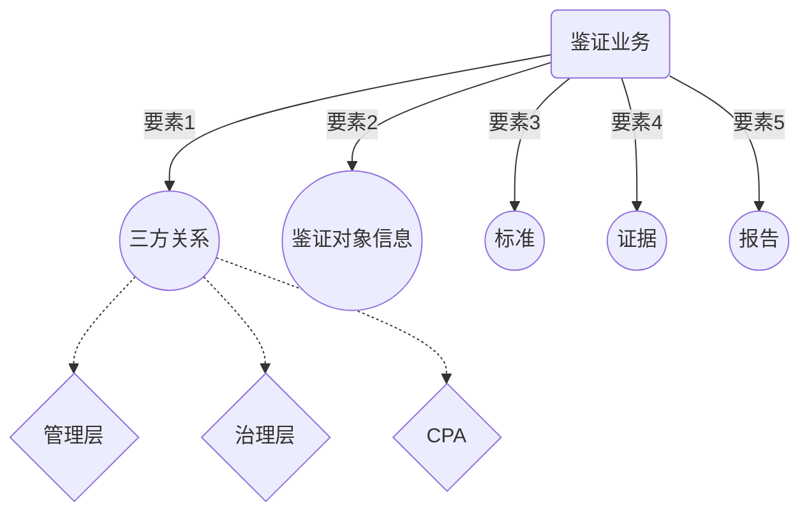
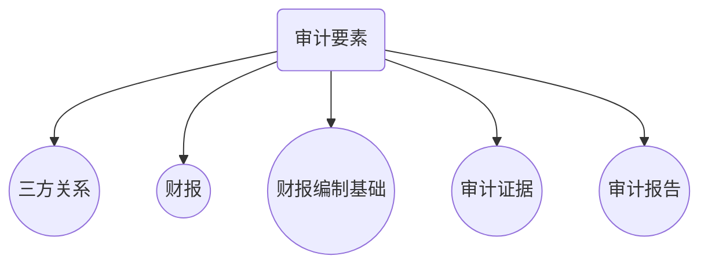
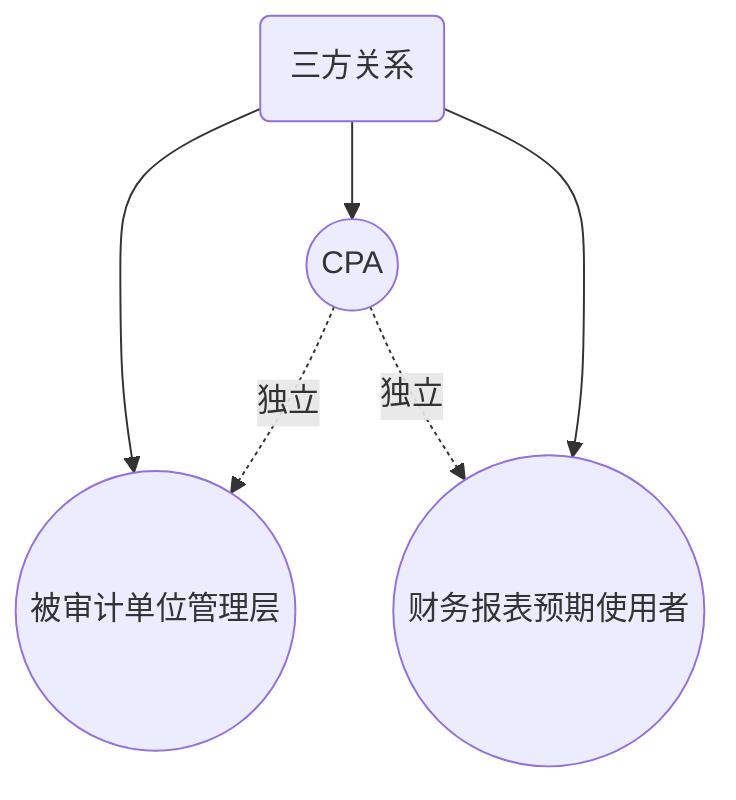
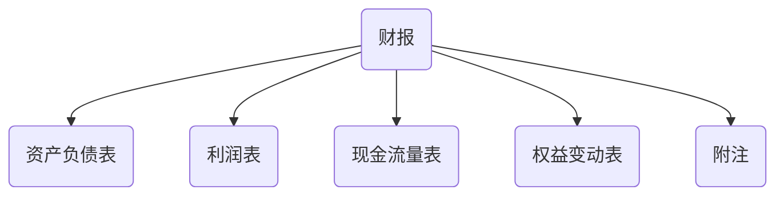
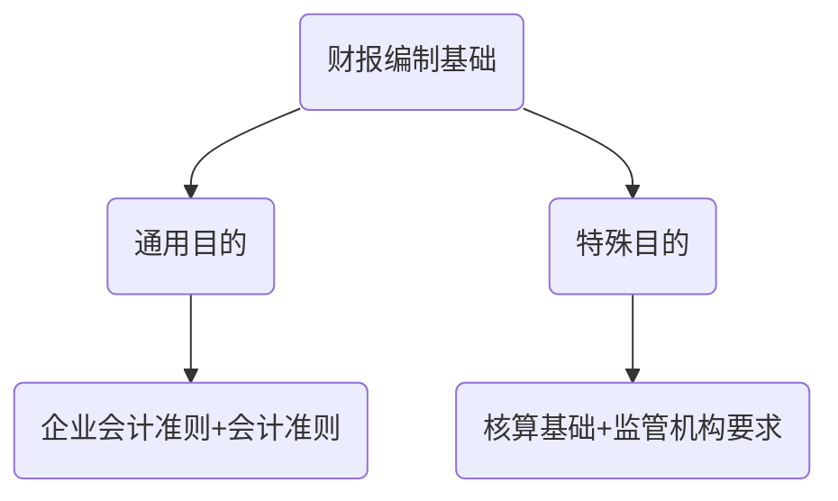

# 要素

> 审计是最典型的**鉴证业务**，审计旨在增进某一==鉴证对象信息==的**可信性**

## 三方关系

> 注册会计师对由被审计单位管理层负责的财报发表审计意见，以增强除**管理层以外**的预期使用者对财报的**信赖程度**。由于财报是由被审计单位管理层负责的，因此，CPA的审计意见主要是向**除管理层之外**的预期使用者提供。

> 由于审计意见有利于提高财务报表的可信性，==有可能==对管理层有用，因此，在这种情况下，管理层==也会==成为预期使用者之一，**但不是唯一**的预期使用者。

### CPA

**CPA**：是指**取得注册会计师证据==并==在会计师事务所执业的人员，**通常**是指项目合伙人或项目组其他成员，**有时指所在的会计师事务所。

#### 被审计单位管理层（责任方）

**责任方**：是指==对财报负责==的组织或人员，即被审计单位管理层。

**管理层**：是指==对==被审计单位==经营活动==的执行负有经营责任的人员。

**治理层**：是指==对==被审计单位==战略方向==以及管理层履行经营管理责任负有==监督责任==的人员或组织。

**执行审计业务前提**：管理层==**和**==治理层认可==并==理解其应当承担的责任

**CPA按照审计准则执行审计的基础**：

1. 按照适用的**财报编制基础**编制并使其**公允反映**
2. 设计，执行和维护必要的**内部控制**，以使财报不存在由舞弊或错误导致的重大错报
3. 向注册会计师提供必要的工作条件，包括==允许==CPA接触与编制财报**有关**的==所有信息==，向CPA提供审计所需的其他信息，==允许==CPA在获取审计证据时**不受限制**的接触其认为必要的**内部人员**和其他有关人员。

> 财报审计**并不减轻**管理层或治理层责任。
>
> > 管理层和治理层**理应**对编制财报承担==完全责任==
> >
> > > 若果财报存在重大错报，而CPA没有发现，==也不能因为==财报已经被CPA审计一事实而减轻管理层和治理层对财报的责任。

### 预期使用者

**预期使用者**：是指预期使用审计报告和财报的组织或人员。

> 当预期使用者存在不同的利益要求时，预期使用者==主要是指==与财报有**重要和共同利益**的==主要==利益相关者。
>
> > CPA==应当==根据法律法规的规定或与委托人签订协议识别预期使用者。

### 财报（鉴证对象信息）

**适当的鉴证对象具备条件：**

1. 可以**识别**
2. 不同组织或人员按既定标准进行评价或计量结果**合理一致**
3. CPA==能够收集==与鉴证对象有关的信息，获取**充分，适当**的证据，支持结论。

**鉴证对象（财报审计）：** 历史财务状况，经营业绩和现金流量

**鉴证对象信心（财报审计）：** 财报

**财报构成：** *（四表一注）*

### 财报编制基础（标准）

> 标准是对所要发表意见的鉴证对象进行**度量**的==尺子==，责任方和CPA可以根据这把==尺子==对鉴证对象进行**度量**

**适当的标准具备的特征：**

1. **相关性：**有助决策，便于决策者使用
2. **完整性：**不应该忽略可能影响计量的因素
3. **可靠性：**能力相近，环境相似，得出合理一致的评价
4. **中立性：**无偏向结论
5. **可理解性：**清晰，易理解，不歧义结论

## 审计证据

> **审计证据：**是指CPA为了==得出==审计结论和==形成==审计意见而使用的**必要信息**。

**审计证据在性质上具有积累性**

**审计证据的充分性和适当性相互关联**

1. **充分性：** 量的要求
2. **适当性：** 质的要求

> ​	审计证据的**可靠性**受==来源==和==性质==影响，并取决于获取审计证据的==具体环境==。

> ​	由于不同来源或不同性质的证据可以证明同一认定，CPA**==可以==**考虑获取证据的成本与所获取信息有用性之间关系，**==但不应仅仅==**以获取证据的困难和成本为由减少不可代替的程序。

> ​	评价证据充分性与适当性以支持鉴证报告时，CPA**应当**运用职业判断，并保持职业怀疑。

### 审计报告

**审计报告:** CPA应当针对财报在**所有**==重大方面==是否符合适当的财报编制基础，以书面报告的形式发表能够提供合理保证程度的意见。