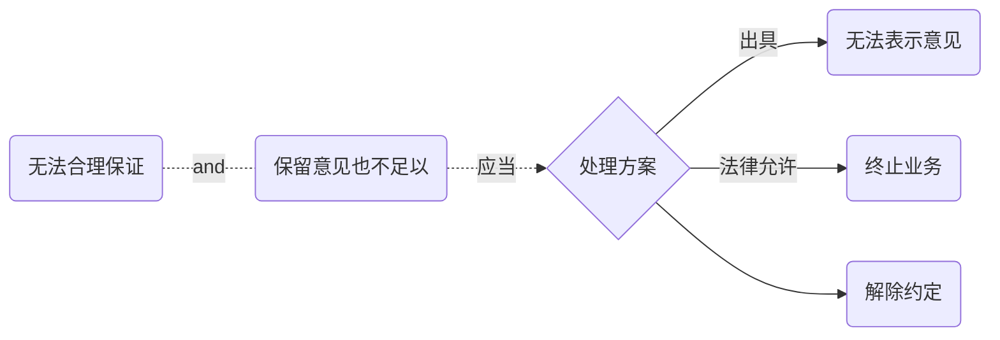
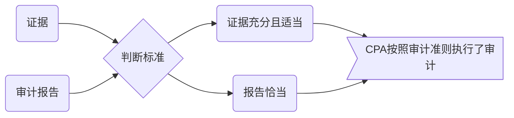
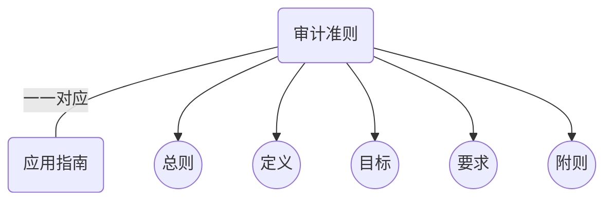
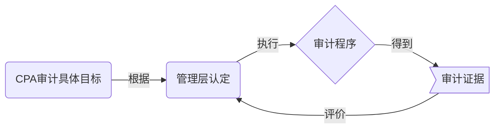
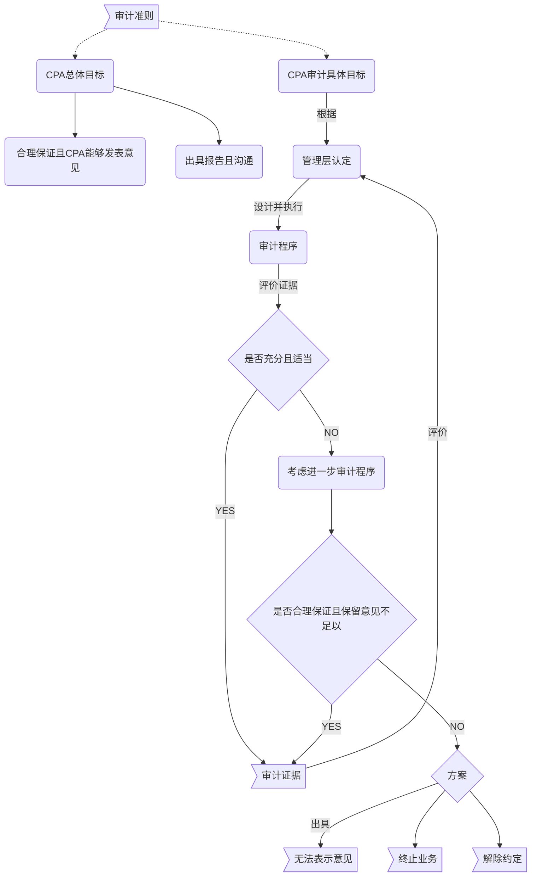

# 目标

## 总体目标

1. 对财报**==整体是否不存在==**由于舞弊或错报导致的重大错报获取**合理保证**，使的CPA**能够**对财报是否在**==所有重大方面==**按照适用的财报编制基础编制发表审计意见。
2. 按照审计准则规定，根据审计结果对财报出具**==审计报告==**，并与管理层和治理层**==沟通==**。

> **在任何情况下**，**==如果不能==**获取*合理保证*，**==并且==**在审计报告中发表保留意见**==也不足以实现==**向预期使用者报告目的，CPA**==应当==**按照审计准则规定出具**无法表示意见**的审计报告，或者在法律允许的情况下**终止**审计业务或**解除约定**。

### 评价CPA是否按照审计准则执行审计标准

> CPA是否按照审计准则的规定执行了审计工作，取决于CPA在具体情况下实施审计程序，由此获取审计证据的充分性和适当性；以及根据总体目标和对审计证据评价结果而出具审计报告的恰当性。

### 审计准则

> 审计准则作为一个整体，为CPA执行审计以实现总体目标提供了**标准**。
>
> > 审计准则规范了CPA的一般责任以及在具体方面履行这些责任时的进一步考虑。
> >
> > > 在执行审计工作时，**==除了==**遵守审计准则外，CPA**==可能还需要==**遵守法律法规的规定。

> 每项审计准则均包含一个或多个目标，这些目标将审计准则的要求与CPA总体目标相关联。
>
> > CPA需要考虑应用“目标”决定是否需要实施追加的审计程序。
> >
> > > 在CPA的总体目标下，CPA需要运用审计准则规定的目标以评价是否获取充分，适当的审计证据。如果没有获取充分且适当证据，CPA可以采取下列一项或多项措施：
> >
> > 1. 评价，通过遵守其他审计准则，是否已经获取或将会获取进一步审计证据
> > 2. 执行，一项或多项审计准则要求时，扩大审计范围
> > 3. 实施，CPA根据具体情况人为必要的，其他程序。

### 认定

**认定：** 管理层在财报中做出的**==明确==**或**==隐含==**的表达，CPA将其用于考虑可能发生的不同类型的潜在错报。

> CPA的基本责任就是：确定被审计单位管理层对其财报的认定是否恰当。

### CPA的==认定==类型：

| 资产负债表事项 | 利润表事项   | 列报披露事项  |
| ------- | ------- | ------- |
| 存在      | 发生      | 发生      |
| 权力义务    | 准确性     | 权利义务    |
| ==完整性== | ==完整性== | ==完整性== |
| 计价分摊    | 截止      | 准确性和计价  |
|         | 分类      | 分类和可理解性 |

### 审计目标

**认定与目标的关联**

#### 由认定推导的审计目标

**资产负债表事项审计目标**

| 认定（管理层） | 目标（CPA）               | 解释   |
| ------- | --------------------- | ---- |
| 存在      | 记录的金额==确实存在==         | 高估   |
| 权力与义务   | 资产负债==确实归属==被审计单位     |      |
| 完整性     | ==已经存==在的金额均==已记录==   | 低估   |
| 计价和分摊   | 资产负债权益已恰当包括，相关分摊已恰当记录 |      |

**利润表事项的审计目标**

| 认定（管理层） | 目标（CPA）           | 解释   |
| ------- | ----------------- | ---- |
| 发生      | ==已记录==的是真实的      | 高估   |
| 完整性     | ==已发生==的交易==已记录== | 低估   |
| 准确性     | 已记录的按正确金额         |      |
| 截止      | 接近资产负债表日交易记录于恰当期间 |      |
| 分类      | 已记录的交易经过恰当分类      |      |

**列报披露事项审计目标**

| 认定（管理层） | 目标（CPA）             | 解释                            |
| ------- | ------------------- | ----------------------------- |
| 发生及权力义务 |                     | ==没有发生==或==无关==的交易包括在财报中，*违反* |
| 完整性     |                     | 应当披露，但没披露，*违反*                |
| 分类和可理解  | 财务信息已被恰当列报和描述且披露内容  |                               |
| 准确性和计价  | 财务信息和其他信息已公允披露且金额恰当 |                               |

**认定——>目标——>程序**

| 认定   | 目标       | 程序                  |
| ---- | -------- | ------------------- |
| 存在   | 财报列示存在   | 监盘                  |
| 完整性  | 已发生，已记录  | 顺查                  |
| 准确性  | 金额数量准确   | 价格清单+订购单+发货单        |
| 截止   | 记录于恰当期间  | 比较上一期期末与下期期初销售与记账日期 |
| 权力义务 | 归属于被审计单位 | 查验所有权证书，单据凭证        |
| 计价分摊 | 分摊金额恰当   | 分析，重新计算，对比是否恰当      |

# 知识点地图

