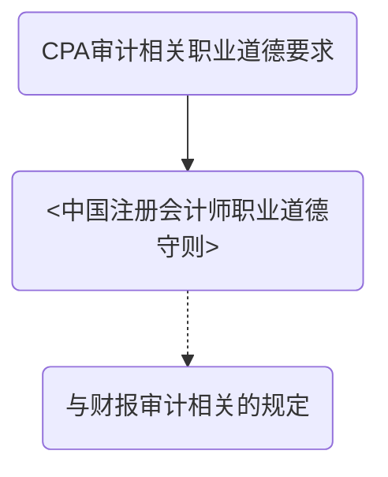
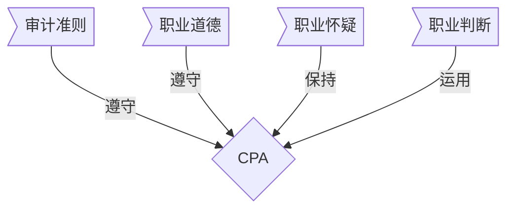

# 基本要求

## 遵守《审计准则》

> 《中华人民共和国注册会计师法》第二十一条规定：
>
> ​	注册会计师执行审计业务，必须按照执业准则，规则确定的工作程序出具报告。
>
> 第三十五条规定：
>
> ​	中国注册会计师协会依法拟订注册会计师执业准则，规则，报国务院财政部门批准后施行。

## 遵守《中国注册会计师执业道德守则》

##保持职业怀疑

> ​	在计划和实施审计工作时，CPA应当保持职业怀疑，认识到可能存在导致财报发生重大错报的情形。

**职业怀疑**是一种态度；包括：

1. 对可能舞弊错报的情况保持警觉
2. 对审计证据进行审慎评价

###对职业怀疑的理解：

1. 在本质上要去秉承一种质疑理念
2. 对疑虑情况保持警觉
3. 要求审慎评价证据
4. 要求客观评价管理层和治理层

### 职业怀疑作用

| 适用阶段         | 作用                   |
| ------------ | -------------------- |
| 识别评估重大错报风险   | 恰当评价，针对了解环境，有效识别风险   |
| 设计和实施进一步审计程序 | 合理评估，恰当设计，保持警觉，进一步应对 |
| 评价证据         | 考虑充分适当性，纠正偏向         |
| 发现舞弊，防止审计失败  | 至关重要                 |

##合理利用职业判断

> ​	职业怀疑是指，审计准则，财报编制基础和职业道德要求的==框架下==，CPA综合运用相关知识，技能和经验，做出==适合==审计业务具体情况，==有根据==的行为决策。

**尤为需要职业判断的审计环节**

1. 确定重要性，识别和评估重大错报风险
2. 确定所需要实施的审计程序的性质，时间安排和范围
3. 评价是否已获取充分适当的审计证据以及是否需要执行更多工作
4. 评价管理层在运用适用的财报编制基础的判断
5. 评价管理层会计估计的合理性
6. 运用职业道德框架，识别，评估，应对基本影响

**CPA做出符合规定的职业判断==决策过程==**

**衡量职业判断质量的三方面**

1. 准确性（意见一致性）：判读与客观事实相符程序，或者，不同主体对同一职业问题判断的认同程序。
2. 决策一贯性和稳定性
3. 可辩护性：能够证明自己工作

*以下事项，CPA作出书面记录，可能很合适*

1. 职业判断的问题和目标==描述==
2. 解决的思路
3. 收集的相关信息
4. 得出的结论和理由
5. 就决策结论与被审计单位沟通方式和时间

# 知识点地图

