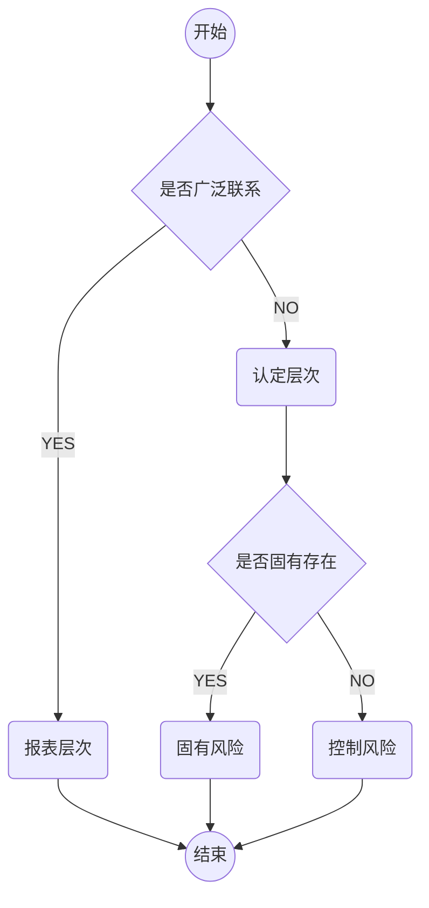
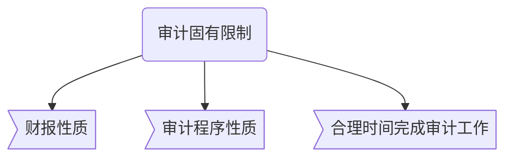

# 审计风险

> 审计风险，是指当财报**==存在==**重大错报时，CPA发表**==不恰当==**审计意见的**==可能性==**

**$审计风险=重大错报风险 * 检查风险$**

---

## 重大错报风险

> 重大错报风险，是指财报在**==审计前==**存在的重大错报的**==可能性==**。
>
> > 重大错报风险与被审计单位的风险相关，**且**==独立于==财报**审计**而存在。
> >
> > > 重大错报风险分为：==报表层==次和==认定层==次，认定层次分为：==固有==风险和==控制==风险。

**风险类型识别图**

## 检查风险

> ​	检查风险，是指==如果存在==某一错报，该错报单独或连同其它错报==可能是重大==的，CPA为将审计风险降至可接受低水平而实施程序后==没有发现==这种错报的风险

**检查风险取决于，审计程序==设计==的合理性和==执行==的有效性**

**检查风险不可能降低为零**

> CPA应当合理设计审计程序的性质，时间和范围，并有效执行审计程序，以控制检查风险。

**CPA==不可能==将审计风险降低为零，因此不能对财报不存在由于舞弊或错报导致的重大错报获取==绝对保证==。**

**由于审计存在==固有限制==，因此，得出审计意见的证据是==说服性==而非结论性的**

