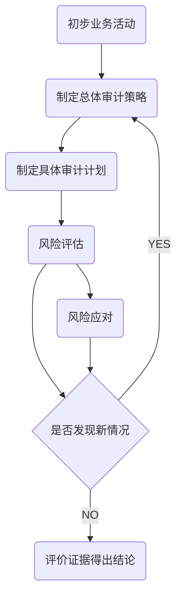
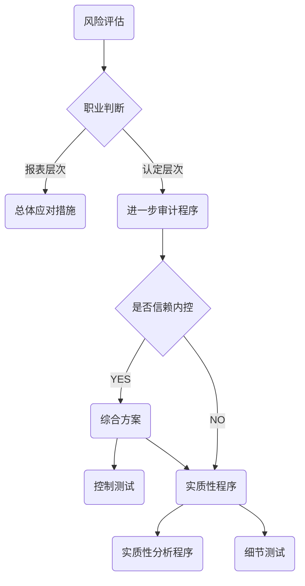
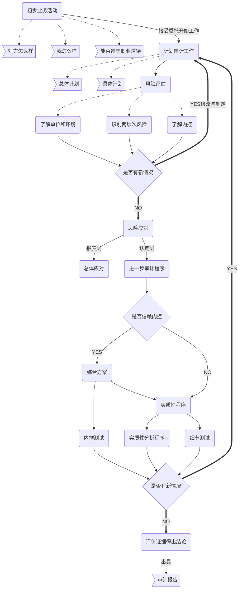

# 过程

> ​	==风险导向==审计模式要去CPA在审计过程中，以重大错报风险的识别，评估和应对作为工作主线。

## 接受业务委托

​	**在接受新客户的业务前，或决定是否保持现有业务或考虑接受现有客户的新业务时，会计师事务所==应当==执行有关客户接受与保持的程序，以获取如下信息：**

1. 考虑客户诚信*（对方怎么样？）*
2. 具有执行业务的必要素质，能力，时间和资源*（我怎么样？）*
3. 能够遵守相关职业道德要求*（职业道德）*

## 计划审计工作

> 对于任何一项审计业务，CPA在执行具体审计程序之前，都必须根据具体情况制定科学，合理的机会，使审计工作以有效的方式得到执行。

**计划审计工作流程**

## 识别和评估重大错报风险

> ​	审计准则规定：CPA**==必须==**实施风险评估程序，以此作为评估财报报表层次和认定层次重大错报风险的基础。

---

> ​	风险评估程序，是指CPA为了，了解被审计==单位及环境==，以识别和评估财报报表层和认定层重大错报风险，而实施的==审计程序==。

---

> 风险评估程序是必须程序，了解被审计单位及环境为CPA许多关键环节作出职业判断提供重要基础。

**风险评估主要工作内容**

1. 了解单位和环境
2. 识别和评估报表层与认定层错报风险

## 应对错报风险

## 编制审计报告

# 知识点地图

