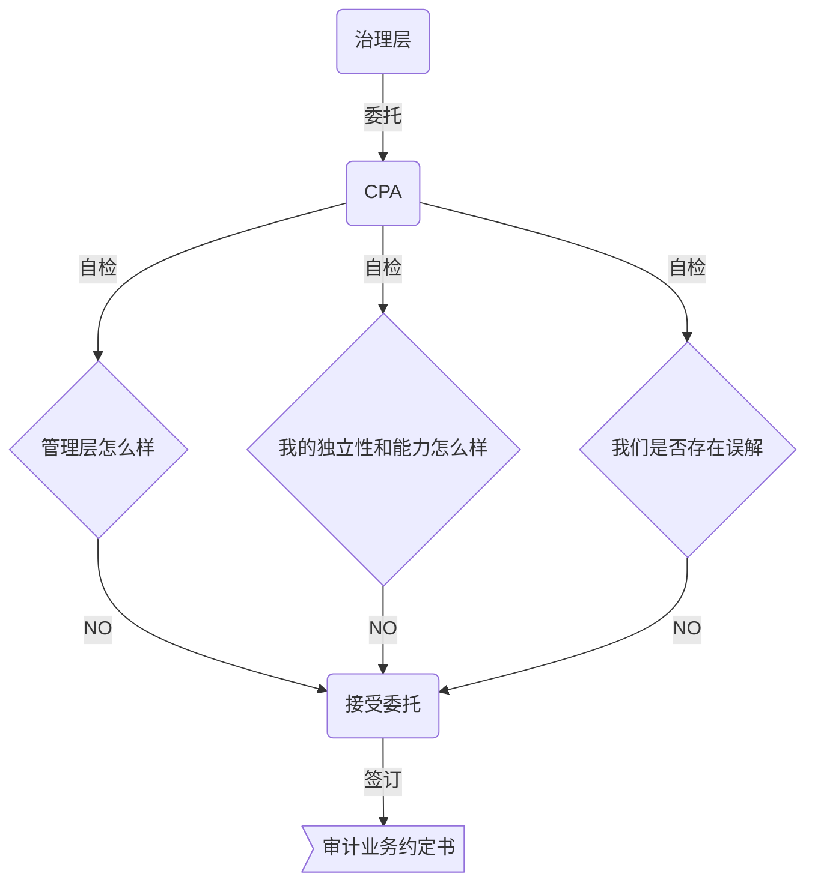
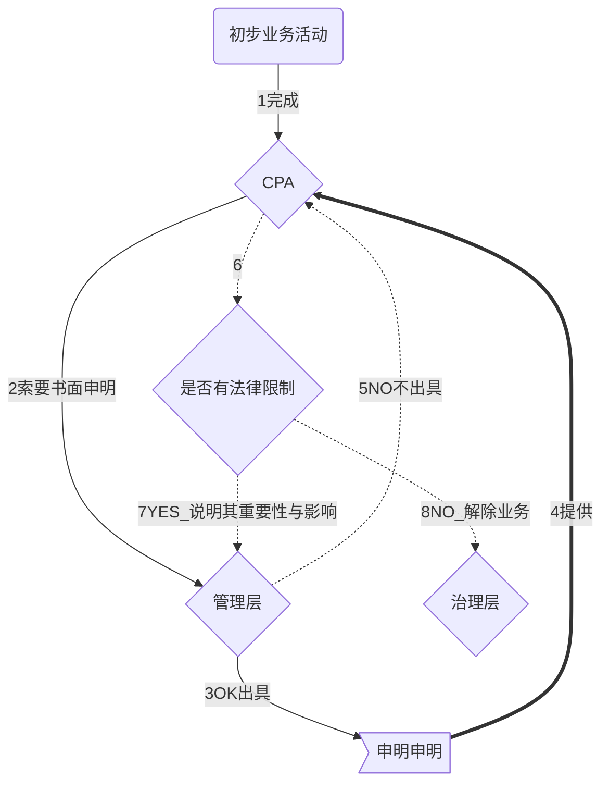
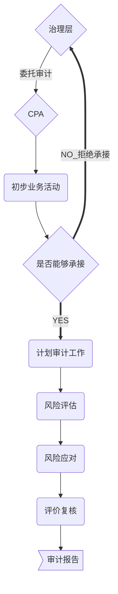
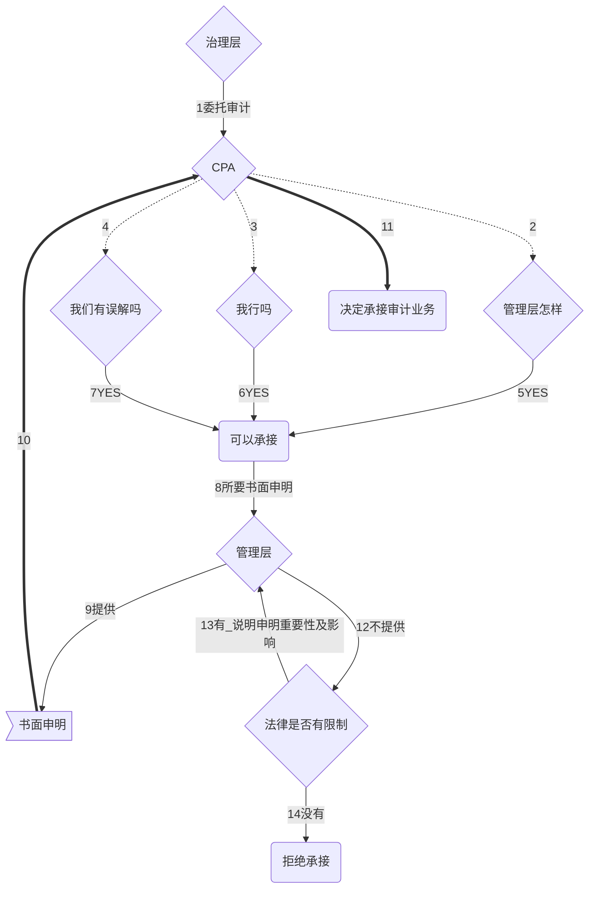

# 初步业务活动

**初步业务活动？**

## 目的与内容

### 目的

1. 不存在因==管理层诚信问题==而可能影响CPA保持该项业务意愿的事项
2. 具备执业所需的==独立性和能力==
3. 与被审计单位不存在对业务约定==条款的误解==

### 内容

1. 针对，保持客户关系和具体审计业务实施==相应的质量控制==程序
2. 评价执业道德要求
3. 就审计业务约定条款达成一致意见

---

## 审计的==前提==

1. 财报编制基础*【尺子】*
   1. 确认编制基础==可接受性==
      1. 被审计单位性质（盈利/非盈利）
      2. 财报目的（光大/特定）
      3. 财报性质（整套/单一）
      4. 法律法规对财报基础的规定
   2. 通用目的编制基础
2. 就管理层责任达成一致意见

> 按照审计准则的规定执行审计工作的==前提==是管理层==认可并理解==其承担的责任。

​	1. 按基础编制并公允反映

​	2. 设计，执行，维护内控，使其不存在重大错报

​	3. 向CPA提供必要的工作条件

3. 确认形式

> 按照审计准则1341号规定：CPA==应当要求==管理层就其履行的某些责任提供书面申明。

​	**如果管理层不认可其责任，或不同意提供书面申明，CPA将不能获取充分，适当的审计证据。**

​	这种情况下，CPA承接此类审计业务是不恰当的，除非法律规定。

**示意图**

## 《审计业务约定书》

> ​	审计业务约定书，是指会计师事务所与被审计单位签订的，用以记录和确认审计业务的委托与受托关系，审计目标，范围，双方责任以及报告形式等事项的==书面协议==
>
> ​	会计师事务所承接==任何==审计业务，==都应当==与被审计单位签订审计业务约定书。

---

### 《约定书》基本内容

1. 审计目标和范围
2. CPA责任
3. 管理层责任
4. 指出所适用的财报基础
5. 提及，CPA拟出具报告预期形式和内容，特定情况下肯能不同于预期的形似与内容说明

### 《约定书》的特殊考虑

1. 特定需求
2. 组成部分审计*（母子公司同一CPA考虑）*
   1. 组成部分CPA委托人
   2. 是否对组成部分单独出具审计报告
   3. 母占子股权份额
   4. 组成部分的独立性
3. 连续审计

> CPA可以决定不在每期都直送新的审计业务约定书。
>
> ​	如下因素，可能导致CPA修改约定条款：
>
> 1. 有迹象表明，被审计单位，误解审计目标和范围
> 2. 需要修改或增加特别条款
> 3. 高管近期变动
> 4. 所有权重大变动
> 5. 业务性质或规模重大变化
> 6. 法律法规变化
> 7. 编制基础变化
> 8. 其他

4. 约定条款的变更

   1. 变更要求*（判断变更理由==合理性==）*
      1. 环境变化对审计需求影响==（通常合理）==
      2. 对原来要求审计的性质存在误解==（通常合理）==
      3. 审计范围限制==（不合理）==
   2. 审计变更为审阅

   审计——>审阅：==不得==提及已经执行的审计业务

   审计——>执行商定程序：==可以==提及已经执行的审计业务

# 知识点地图

**回顾审计流程**

**由上可以看出：初步业务活动是审计的==第一个步骤==**

**初步业务活动的最终产品/成果是：《初步业务约定书》**

