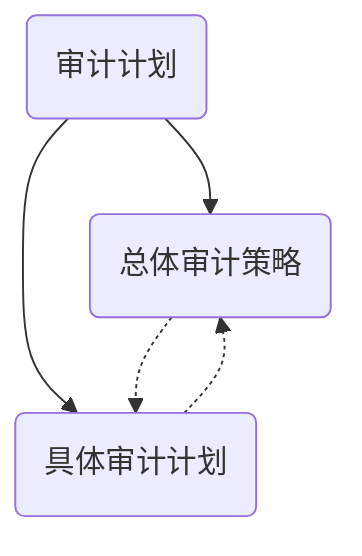
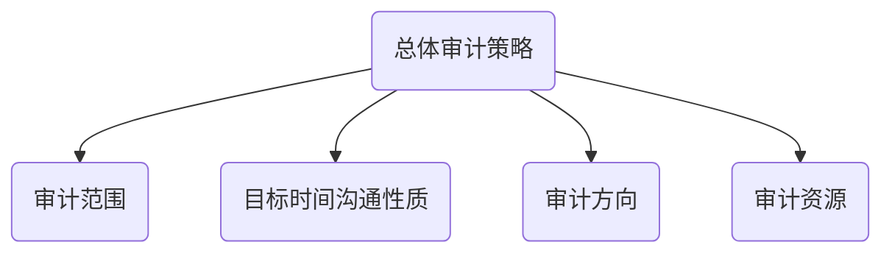
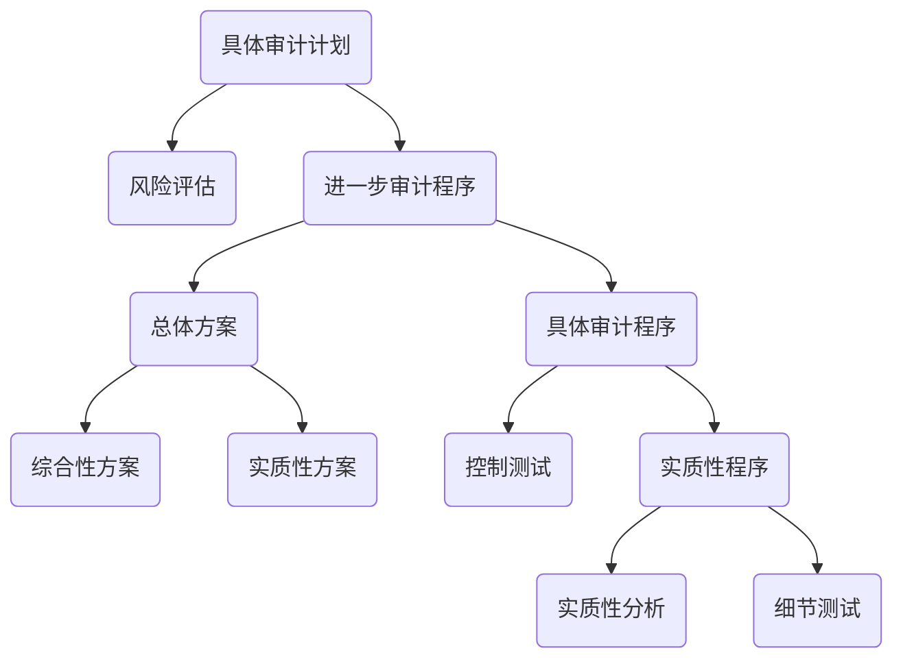
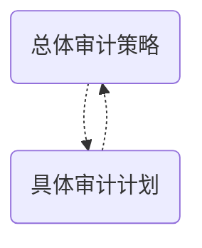
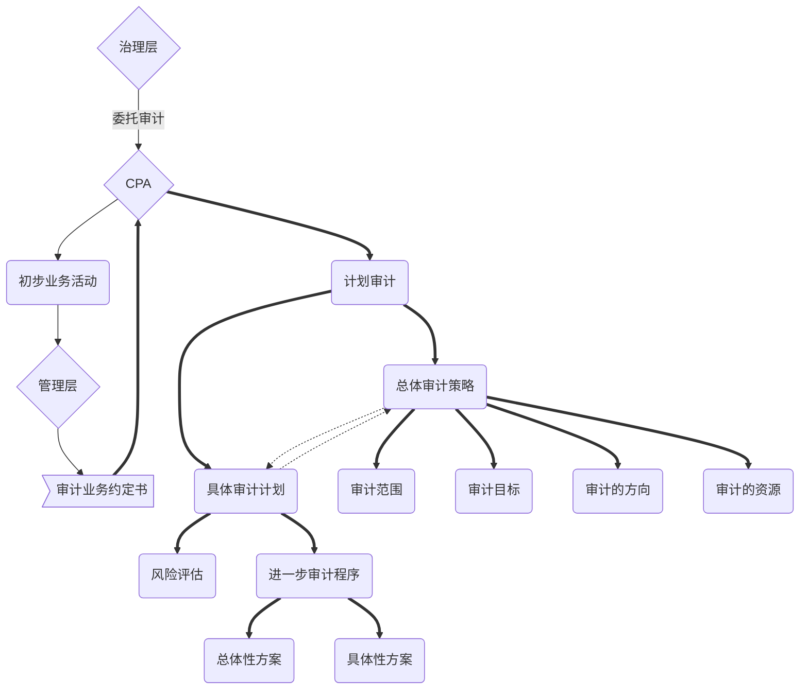

# 总体策略与具体计划

> ​	CPA==应当==针对总体审计策略中所识别的不同事项，制定具体审计计划，并考虑通过有效利用审计资源以实现审计目标。
>
> ​	值得注意的是，总体审计策略和具体审计计划有==内在紧密联系==，对其中一项的决定可能会影响甚至改变对另一项的决定

## 总体审计策略

### 审计范围

1. 编制基础
2. 特定报告要求
3. 预期工作范围
4. 母子控制关系，合并财报
5. 组成CPA范围
6. 经营分部性质
7. 外币折算
8. 合并和个别审计要求
9. 内审可获得性
10. 外币服务内控有效性
11. 利用以前审计证据
12. 信息技术
13. 审计与中期审阅时间安排
14. 被审计单位人员时间协调和数据可获得性

### 审计目的，时间，沟通性质

1. 单位对外报告时间表
2. 与管理层，治理层会谈，讨论性质，时间，范围
3. 与管理层，治理层讨论拟出具报告类型和时间安排
4. 与管理层讨论，预期沟通
5. 与组成部分CPA沟通，拟出具报告类型，时间安排
6. 成员之间沟通，预期性质和时间安排
7. 预期是否需要和第三方沟通

### 审计方向==（领域）==

1. 重要性
   1. 确定重要性
   2. 为组成部分确定重要性，且与组成部分CPA沟通
   3. 审计过程重新考虑重要性
   4. 识别重要组成部分与账户
2. 高风险领域
3. 评估，报表层面错报对指导，监督，复核的影响
4. 人员选择和分工
5. 项目预算
6. 向成员强调审计过程中职业怀疑
7. 前期对内控有效评价结果
8. 管理层重新设计，实施内控的证据
9. 根据业务量，确定是否依赖内控
10. 对内控的重视程序
11. 对被审计单位影响重大的因素
12. 重大行业发展情况
13. 准则的变化
14. 其他

### 审计资源

1. 向具体审计领域调配资源
2. 调配多少资源？
3. 何时调配资源？
4. 如何管理，指导，监督

## 具体审计计划

> ​	可以说，为获取充分，适当的审计证据，而确定的审计程序性质，时间安排和范围是具体审计计划的核心

## 审计过程对计划的更改

> ​	计划审计工作并非审计业务的一个孤立阶段，而是一个持续的，不断修正的过程，贯穿于整个审计业务的始终。

> 如果CPA在审计过程中对总体审计策略或具体审计计划作出了重大修改，应当在审计工作底稿中记录作出重大修改及其理由。

### 指导，监督，复核

1. 被审计单位的规模和复杂程度
2. 审计领域
3. 评估重大错报风险
4. 组内成员的能力

# 知识点地图

**回顾审计流程**

