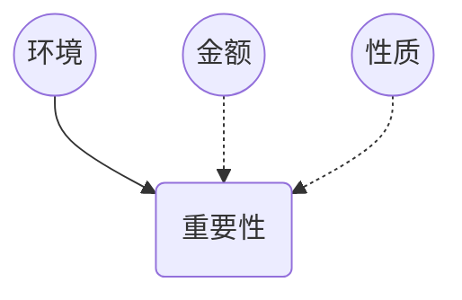
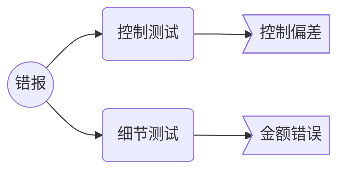
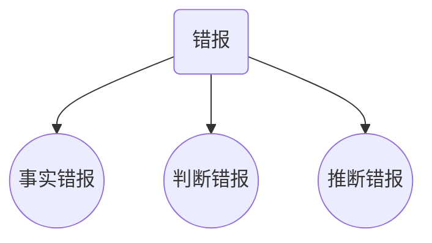
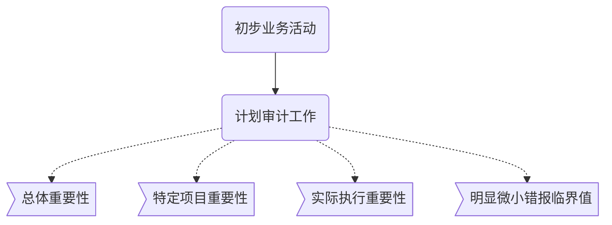

重要性

## 重要性？

1. 如果合理预期错报单独或汇总可能影响财报使用者依据财报作出经济决策，则通常认为错报是重大的。
2. 重要性的判断是依据具体环境作出的，并受错报金额或性质的影响或相互影响
3. 判断某事项的是否重大，是在考虑预期使用者整体共同财报信息需求的基础上作出的。

> 在审计开始时，就必须对重大错报的规模和性质做出判断。
>
> （整体重要性+特定交易重要性+账户余额+披露重要性）

**CPA使用==重要性==的目的？**

1. 决定风险评估程序的性质，时间安排和范围
2. 识别和评估重大错报风险
3. 确定进一步设计程序的性质，时间安排和范围



## 重要性确认

1. 财报整体重要性

   > CPA在制定总体审计策略时，应当确定财报的整体重要性

   ```mermaid
   graph TB
   	a((开始))-->b(初步业务活动)
   	b-->c(计划审计工作)
   	c-.->c1(总体审计策略)
   	c1-.->c13{职业判断}
   	c13==>c11>确定整体重要性]
   	c13==>c12>特定项目重要性]
   	c13==>c14>实际重要性]
   	c13==>c15>明显微小错报临界值]
   	c-.->c2(具体审计计划)
   ```

   $$
   重要性 = 基准\cdot 百分比
   $$

   **基准选择的考虑因素**

   1. 财报要素
   2. 是否存在特别关注事项
   3. 单位性质，生命周期，经济环境
   4. 单位所有权，融资方式
   5. 基准的波动性

   ​

   **实务基准选择**

   | 被审计单位情况      | 可选择基准      |
   | ------------ | ---------- |
   | 盈利稳定         | 经常性业务税前利润  |
   | 大幅波动，盈亏交替    | 3~5年平均税前利润 |
   | 新设，初创期       | 总资产        |
   | 新兴产业，扩发份额与影响 | 营业收入       |
   | 开放基金         | 净资产        |
   | 集团研发中心       | 成本与营业费用    |
   | 公益性组织        | 捐赠收入与支出    |


> CPA为被审计单位选择基准在各年度中==通常==会保持稳定，但是==并非必须==保持一贯性。

2. 特定交易，账户或披露的重要性
   1. 法律法规或准则是否影响对特定项目的计量与披露（管理层，治理层薪酬）
   2. 所处行业相关关键性披露
   3. 预期使用者是否特别关注单独列报某一方面
3. 实际执行重要性

> 确定实际执行重要性并非简单机械的计算，需要CPA运用职业判断并考虑一下因素的影响：
>
> 1. 对被审计单位的了解
> 2. 前期审计中识别错报性质和范围
> 3. 前期识别的错报对本期的影响

> 通常而言，实际执行的重要性通常为财报整体重要性的50%~75%


|      50%       |      75%      |
| :------------: | :-----------: |
|    首次接受委托审计    | 连续审计，以前年度调整较少 |
| 连续审计，但以前年度调整较多 |   项目总体风险较低    |
|      项目风险      |  以前审计经验表明，内控  |
|  存在或预期存在内控缺陷   |               |


4. 修改审计重要性
   1. 审计过程中情况发生重大变化
   2. 获取新信息
   3. 通过进一步审计程序，CPA对被审计单位了解的情况发生变化
5. 运用实际重要性	

CPA可以在计划审计工作时候根据实际执行重要性来决定对那些类型的账户执行进一步审计程序

运用实际执行重要性确定进一步审计程序的性质，时间安排和范围


## 错报



**错报可能由一下事项导致**

1. 收集或处理编制财报数据时数据出错
2. 遗漏某项金额
3. 疏忽或明显误解导致不正确的会计估计
4. CPA认为管理层的认定不合理

**错报累积问题——>明显微小错报**

> 明显微小 ==不等同于== 不重要
>
> 这些明显微小错报，无论单独或汇总起来，无论从规模，性质或发生的环境来看都是明显微不足道的。

确认时，应当考虑的因素：

1. 以前年度审计中识别出的错报
2. 重大错报风险评估结果
3. 管理层和治理层对CPA沟通错报的期望

*管理层和治理层要去知道全部的错报——>明显错报临界值=0*

4. 被审计单位财务指标是否勉强达到监管机构期望

**错报类型**



**对识别出的错报的考虑**

> ​	错报可能不会孤立发生，一项错报的发生还可能表明存在其他错报。
>
> ​	抽样风险和非抽样风险可能导致某些错报未被发现。


# 知识点地图

理解：CPA执行审计工作犹如【织网捕鱼】

==网==，是指执行的审计全流程；

==水域==，是指审计信息对象；

==鱼==，是指CPA卓有成效的收获——发现错报并且能够将重大错报风险降低至可接受低水平。

==重要性==，是指网眼的大小，大一些，就抓大放小，小一些，大小通吃。直接影响CPA【捕鱼的收获程度——CPA审计质量】



