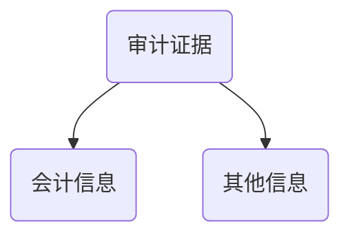
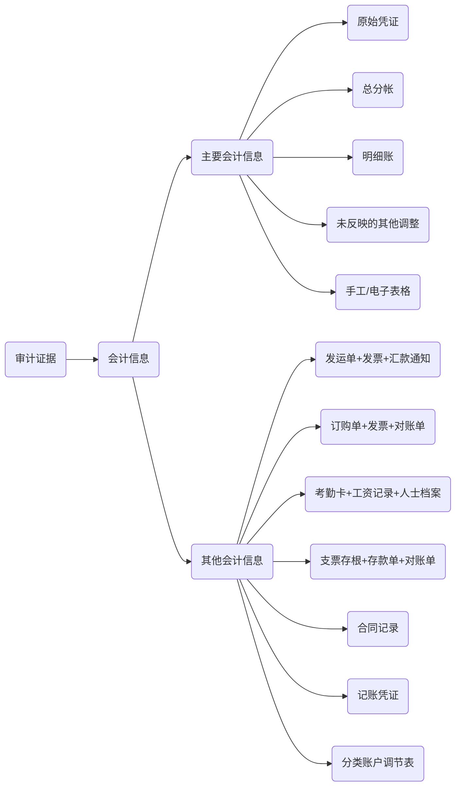
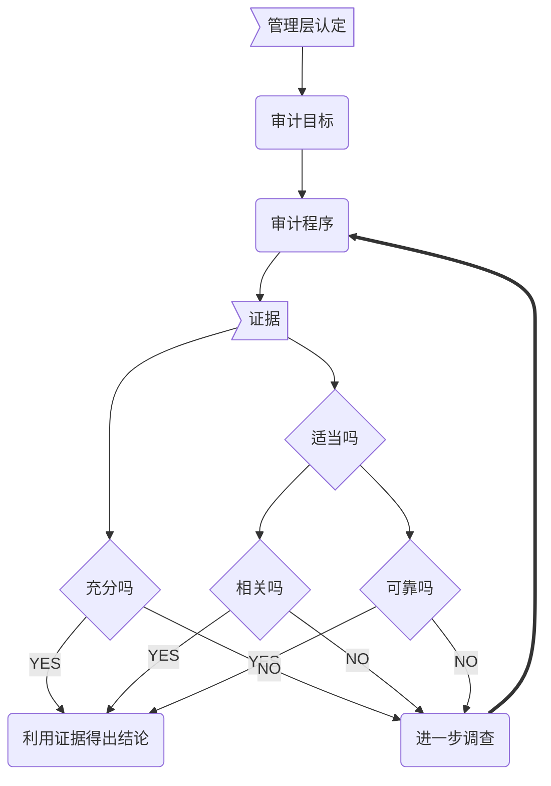

# 证据性质

## 审计证据？

> 审计证据，是指CPA为了得出审计结论，形成审计意见而使用的==所有信息==



> ​	CPA必须在每项审计工作中获取充分，适当的审计证据，以满足发表审计意见的要求。


1. 会计记录

> ​	依据会计记录编制财报是被审计单位管理层责任，CPA==应当==测试会计记录以获得审计证据。




1. 其他信息

> ​	财报依据会计记录中包含的信息和其他信息共同构成审计证据，两者缺一不可。
>
> ​	如果没有前者，审计工作将无法进行；如果没有后者，可能无法识别重大错报风险

## 充分性与适当性

> ​	CPA应当保持职业怀疑态度，运用职业判断，评价审计证据的充分性与适当性。

1. 充分性

> ​	审计证据的充分性是对审计==证据量==的衡量，主要与CPA确定的样本量有关。
>
> ​	CPA仅靠获取更多的审计证据==可能无法弥补==其质量山的缺陷。

1. 适当性

> ​	审计证据的适当性，是指审计证据质量的衡量，即审计证据支持结论的==相关性==和==可靠性==。
>
> ​	只有相关且可靠的审计证据才是高质量的。

​	1.**相关性**

		>相关性，是指审计证据信息与审计==证据的目的==和所考虑的相关==认定==之间的逻辑关系。


 2.  **可靠性**

     > 可靠性是指审计证据的可信程度。

     影响==可靠性==的因素：

     1. 外部独立来源 > 其他来源
     2. 内控有效时生成的证据 > 内控无效时生成的证据
     3. 直接获取 > 间接或推论得出
     4. 文件记录 > 口头
     5. 原件证据 > 传真或复件

	3. 两者的关系

> ​	充分性和适当性是审计证据的两个特征，两者缺一不可，只有充分且适当的审计证据才有证明力。

> ​	审计证据的适当性影响充分性（证据质量越高，所需要的量就要少）

> ​	审计充充分性弥补不了适当性缺陷（质量上的问题，数量再多也没用）

4. 可靠性特殊考虑

   1. 文件记录可靠性考虑

      > ​	审计工作通常不涉及鉴定文件记录的真伪，CPA也不是鉴定真伪的专家，但应当考虑审计证据信息的可靠性并考虑与生产信息相关的内控有效性。

      ```mermaid
      graph TB
      	a>审计信息]-->b(CPA)
      	b-.->b1{是否可靠}
      	b-.->b2{相关内控是否有效}
      	b1--NO-->c(进一步调查)
      	b2--NO-->c
      	c-->c1(第三方询证)
      	c-->c2(利用专家)
      	b1--YES-->d(获取证据得出结论)
      	b2--YES-->d
      ```

   2. 使用被审计单位信息的考虑

   使用被审计单位数据==需要足够==的完整和准确。

   3. 证据相互矛盾的考虑

   > 如果从不同来源获取的审计证据或获取的不同性质的审计证据不一致，表明某项审计证据可能不可靠，CPA应当追加必要的审计程序。

   4. 获取证据成本考虑

   > CPA可以考虑获取审计证据的成本与所得信息有用性的关系，但不应该以获取审计证据的困难和成本为由减少不可代替的审计程序。


# 知识点地图



