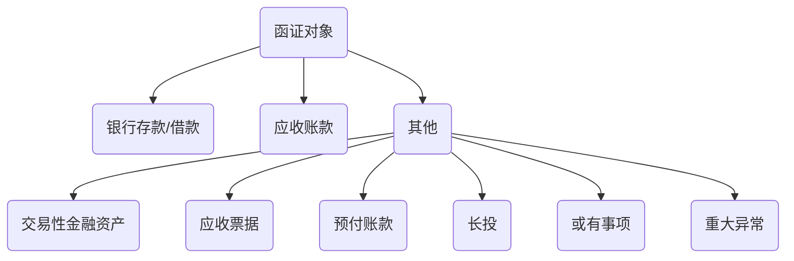
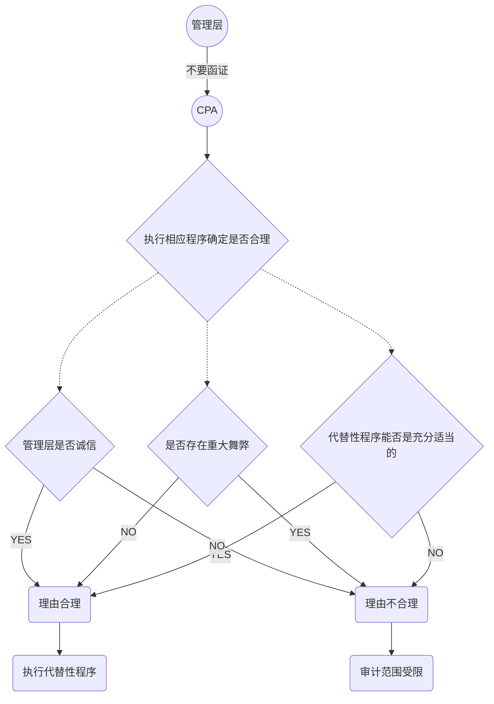
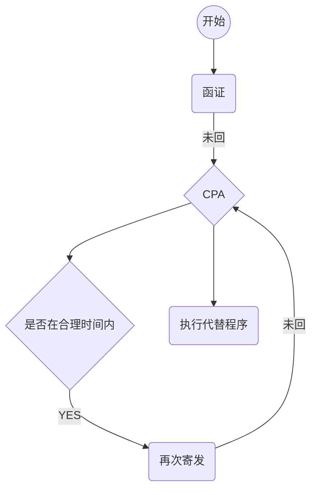

# 函证

## 函证决策

> ​	CPA应当确定是否有必要实施函证以获取==认定层次==的充分，适当的审计证据。

1. 评估认定层次重大错报风险

> ​	评估的认定层次重大错报==风险==水平越高，CPA通过实质性程序获取的审计证据相关性和==可靠性==要求越高。反之。
>
> ​	如果认为某项风险属于==特别风险==，CPA需要考虑是否通过函证特定事项来降低检查风险。

2. 函证针对的认定

> 对于不同的认定，函证的证明力是不同的。
>
> 对特定认定，函证的==相关性==受CPA选择函证的信息影响。

3. 实施除函证外其他程序

   1. 被询证者对函证事项的了解
   2. 预期被询证者对函证的回复意愿
   3. 预期被询证者客观性

   ​

## 内容

1. 对象




1. 实施范围

> ​	选择的样本应当==足以代表==总体。
>
> ​	CPA对被审计单位的了解，评估重大错报风险以所测试总体的特征，CPA==可以==确定从总体中选择特定的项目测试。
>
> **特定项目：**
>
>  	1. 金额较大项目
>  	2. 账龄较长项目
>  	3. 交易频繁但期末余额较小的项目
>  	4. 重大关联交易
>  	5. 重大异常交易
>  	6. 可能存在争议，舞弊或错别


2. 时间

> CPA通常以资产负债表为截止日，在日后适当的时间内实施函证。

3. 如果管理层要去不实施函证？




## 函证设计

1. 总体要求

> ​	CPA应当根据特定审计目标设计询证函。设计服从于审计目标的要求。

1. 考虑因素

   1. 方式
   2. 以往审计类似经验
   3. 拟函证信息的性质
   4. 选择被询证者得适当性
   5. 易于回函的信息类型

2. 积极和消极方式

   1. 积极函证

      1. 列明拟函证的信息，要求被询证者确认是否正确
      2. 不列明信息，要求被询证者填写有关信息

      > 采用积极函证，只有CPA收到回函，才能为财报认定提供审计证据

   2. 消极函证

   > 消极函证只要求被询证者仅在不同意见情况下才予以回函。

   **考虑消极函证情况**

   1. 重大错报评估低
   2. 涉及大量余额较小的账户
   3. 预期不存在大量错误
   4. 没有理由相信被询证者不认真对待函证

## 实施与评价

1. 过程控制

   1. > CPA 应当对函证的全过程保持控制。

   2. 不同方式发函的控制措施

2. 积极式未收到回复处理？




3. 评价证据充分性和适当性

> 如果CPA认为取得积极函证是获取充分，适当证据的必要程序，则代替性程序不能提供CPA所需要的审计证据。

4. 评价函证可靠性

> 函证所获取的证据可靠性主要取决于CPA设计函证，实施函证和评价函证结果等程序的适当性。
>
> ==评价==函证可靠性，考虑因素：
>
> 1. 设计，发出，收回的控制情况
> 2. 被询证者能力，独立性，授权等客观性
> 3. 被审计单位施加限制
>
> 验证回函可靠性，考虑因素：
>
> 1. 邮寄
>    1. 是否为原件
>    2. 是否直接寄送CPA
>    3. 名称地址是否一致
>    4. 邮戳是否一致
>    5. 签章是否一致
> 2. 跟函
>    1. 了解处理函证通常流程和处理人员
>    2. 确认处理函证人员身份和权限
>    3. 观察处理流程是否政策
> 3. 电子
> 4. 口头
>
> ```mermaid
> graph TB
> 	a>函证]-->b(被询证者)
> 	b--1口头-->c{CPA}
> 	c--2可以要求书面回复-->b
> 	b--3拒绝回复-->c
> 	c--4-->d(代替程序)
> ```


5. 对不符事项处理

CPA应当调查不符事项，以确定是否表明存在错报。

6. 及时关注舞弊迹象和应对
   1. 需要关注的舞弊风险
      1. 不允许发函
      2. 拦截，篡改
      3. 回函地址不一致
      4. 私人邮箱发出
      5. 邮戳地址不一致
      6. 同一日，多笔回函
      7. 不正常回函率
      8. 被询证者缺乏独立性
   2. 针对舞弊的应对
      1. 验证被询证者存在性
      2. 核对地址
      3. 档案与签章核对
      4. 直接与被询证者沟通
      5. 分别期中，期末发函，核对变化
      6. 从金融机构获取记录


