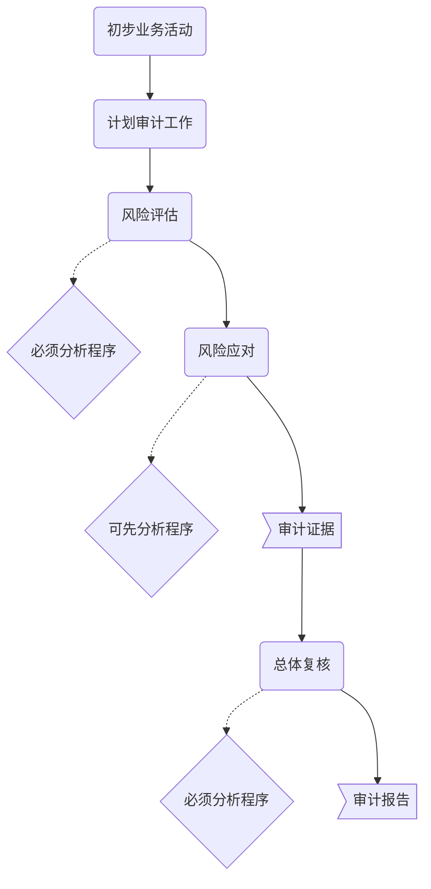

# 分析程序

## 目的

1. 风险评估，以了解被审计单位及环境
2. 当使用分析程序比细节测试更有效地将认定层次的检查风险降至低水平，风险程序==可以用作==实质性程序
3. 在审计结束或邻近结束时对财报进行总体复核

> ​	值得说明的是，CPA在==风险评估==和审计结束阶段的==总体复核====**必须**==运用分析程序，在实施实质性程序阶段，==**可选**==用分析程序。

## 风险评估程序（==必须用==）

1. 总体要求

运用分析程序的目的是==了解==被审计单位及环境并==评估==重大错报风险。

2. 在风险评估中的具体运用

需要注意的是，CPA==无须==在了解被审计单位及环境的==每一方面==都实施分析程序。

3. 风险评估程序中运用分析程序的特点

风险评估运用分析程序，主要目的是在于识别哪些可能表明财报存在重大错报的异常变化。分析手段，通常包括：余额==变化分析==，==趋势==分析和==比率==分析。

## 用作实质性程序（==选用==）

1. 总体要求

**实质性分析程序**，实质用作实质性程序的分析程序，他和细节测试都能用于收集信息，识别认定层次重大错报。

**在使用分析程序执行实质性程序时候，CPA都应考虑：**

1. 评估认定的重大错报风险和实施细节测试，确认分析程序的适用性。
   2. 考虑信息的来源，可比，性质和相关性，确认信息的可靠性
   3. 对已记录的信息作出预期，评价预期值的精确度是否能够识别错报风险
   4. 确定已记录信息和预期值的可接受的差异额
2. 确定实质性分析程序对特定认定的适用性

实质性分析程序通常更适用在一段时期内存在预期关系的大量交易。

3. 数据的可靠性
   1. 内部数据：
      1. 前期数据
      2. 当期财报
      3. 预算数据
      4. 非财务数据
   2. 外部数据	

数据的可靠性直接影响数据形成的预期值。

**数据的可靠性收到来源和性质的影响**

  1.  可获得信息的来源

      		1. 可获得信息的可比性
      		2. 可获得信息的相关性
      		3. 与信息编制相关的控制，确保信息完整，准确和有效

      ​

      4. 评价预期值的准确性程序（精确度）
         1. 对实质性分析程序预期结果做出预测的准确度
         2. 信息的可分解度
         3. 财务和非财务信息的可获得行
      5. 已记录金额和预期值之间可接受的差异额

      评估的风险越高，证据需要越多，可接受的差异额越小。

## 用于总体复核（==必须用==）

1. 总体要求

> 目的是确认财报整体是否与其对被审计单位的了解一致。

2. 总体复核阶段的特点

复核阶段与评估阶段分析程序的程序基本相同，但两者得目的不同。

3. 在评估重大错报风险

如果复核阶段，识别出以前未识别出的重大错报风险，CPA应当重新评估全部或部分账户的评估是否恰当，再次基础上，再评估并确定是否追加必要的程序。

# 知识点地图

