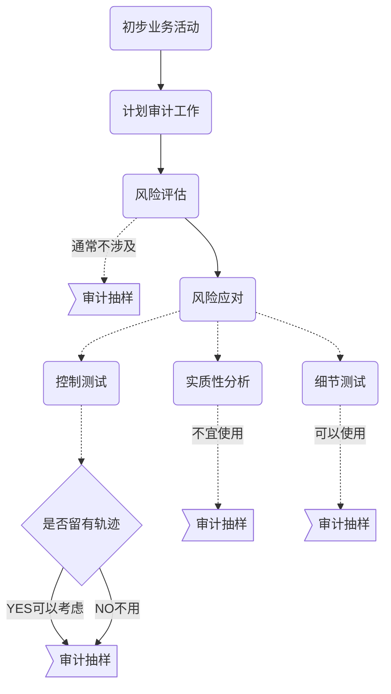
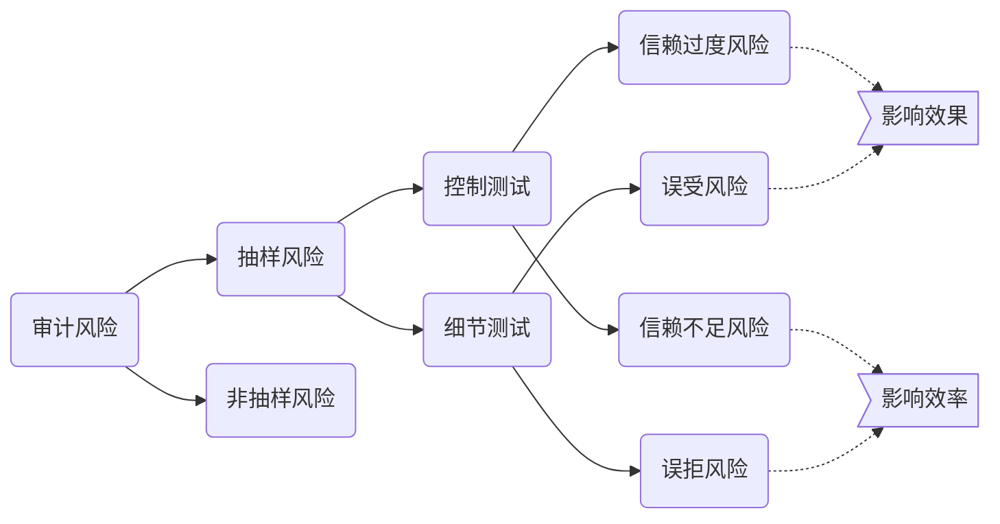
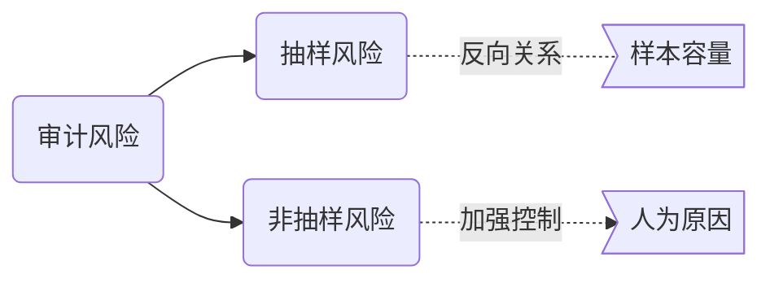
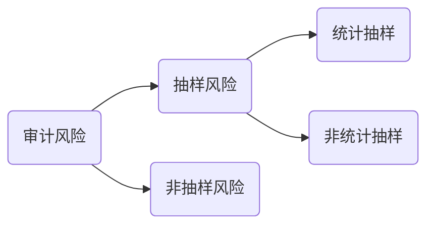
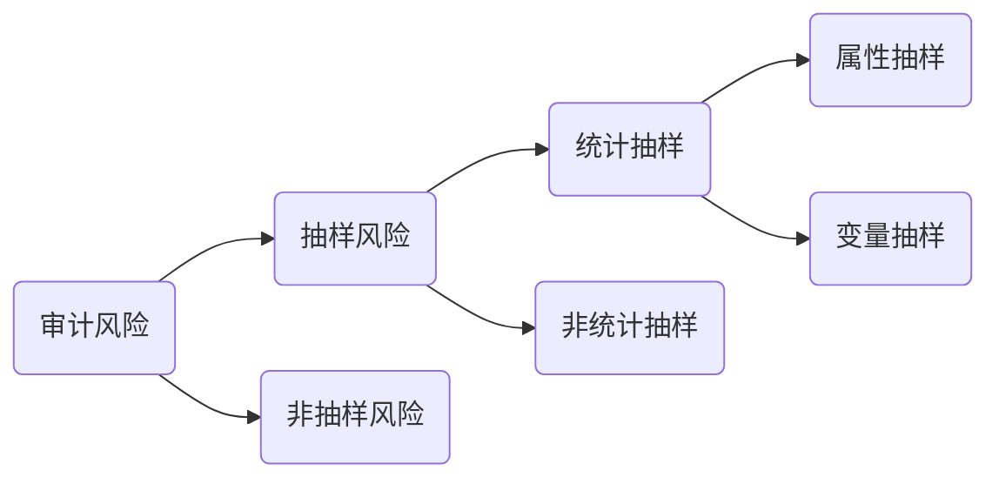

# 概述

CPA在获取充分，适当证据时，需要选取项目进行测试，选取的方法有三种：

1. 全部项目进行测试
2. 特定项目测试，但不能推断总体
3. 审计抽样，以样本结果推断总体

## 审计抽样？

1. 对总体低于百分之百
2. 所有单元都有机会被抽取
3. 通过样本能能推断总体

## 特点

1. CPA应当确定适合与特定审计目标的总体，并从众选取低于百分之比的样本实施审计程序。
2. 所有抽样单元都应当有被选取的机会。
3. CPA目的不是评价样本，而是对总体得出结论。

> 值得注意的是，只有当从抽样总体中选取具有代表性时，CPA才能更具项目测试结果推断总体。

## 适用性

## 抽样和非抽样风险

1. 抽样风险

**抽样风险**，是指通过抽样得出的结论与全部检查得出的结论出现差异的风险。

> 抽样风险是由抽样引起的，与抽样的==样本==与==抽样方法==有关。

> 只要使用了审计抽样，抽样风险==总会==存在。

> 抽样风险与==样本量==成==反向==关系。

## 非抽样风险

> 非抽样风险是指，由于==任何==与==抽样风险无关==的原因而得出错误结论的风险。

1. CPA选取了不合适的审计程序
2. CPA选择的总体不适于测试目标
3. CPA未能适当的定义误差
4. CPA未能适当的评价审计发现的情况

## 统计抽样和非统计抽样

> 所有的审计抽样都需要CPA运用职业判断，计划并实施抽样程序，评价样本结果。

### 统计抽样

1. 随机选取样本项目
2. 运用概率论评价样本结果

### 非统计抽样

> 非统计抽样无法准确的控制抽样风险。

## 属性和变量抽样

### 属性抽样

​	属性抽样是一种用来对总体中某一事件发生率得出结论的统计抽样方法。（常用与控制测试）

### 变量抽样

​	变量抽样是一种用来评价总体金额得出结论的抽样方法。

