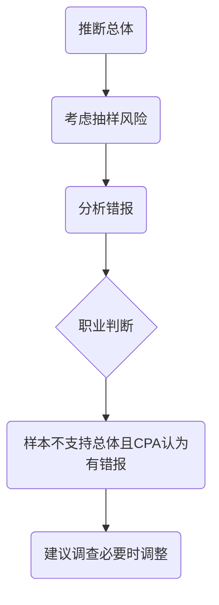

# 细节测试

## 样本设计阶段

1. 确定测试目标
   1. 细节测试的目的是识别财报中各类交易，账户和披露存在重大错报。
2. 定义总体
   1. 适当性
      1. CPA应当确定抽样粽子适于特定的审计目标。
   2. 完整性
      1. 总体的完整性包括代表总体实物的完整性。
3. 定义抽样单元
4. 界定错报

## 选取样本

1. 确定抽样方法
   1. 货币单元抽样
      1. 货币单元抽样是一种运用属性抽样原理对货币金额，而不是对发生率得出结论的统计抽样方法。
      2. 优点
         1. 基于属性抽样原理，对样本规模和评价更加容易
         2. 确定样本规模时，无需直接考虑总体的特征
         3. 被选取概率与金额成比率，无需考虑分层
         4. 当项目金额大于间距是，项目自动被选取
         5. 如果预计不存在错报，样本规模相对于传统要少
         6. 样本容易设计且能够在得到完整总体前开始选取
      3. 缺点
         1. 不适用与总体低估
         2. 零余额和负余额特殊考虑
         3. 发现错报，如果风险水平一定时，可能高估风险，导致拒绝
         4. 需要逐个累积总体金额和财报列示对比
         5. 当预计总体错报金额增加时，样本规模可能增加且大于传统规模
   2. 传统变量抽样
      1. 均值法

         1. $$
            样本审定金额平均值 = \frac{样本审定金额}{样本规模}
            $$

         2. $$
            估计总体金额 = 样本审定金额的平均值 \cdot 总体规模
            $$

         3. $$
            推断总体错报 = 总体账面金额 — 估计的总体金额
            $$

      2. 差额法

         1. $$
            样本平均错报 =\frac{(样本账面金额  — 样本审定借) } {样本规模}
            $$

         2. $$
            推断总体错报 = 样本平均错报 \cdot 总体规模
            $$

         3. $$
            估计的总体金额 = 总体账面金额 — 推断的总体错报
            $$

      3. 比率法

         1. $$
            比率 = \frac{样本审定金额}{样本账面金额}
            $$

         2. $$
            估计的总体金额 = 总体账面金额 \cdot 比率
            $$

         3. $$
            推断的总体错报 = 总体账面金额 — 估计的总体金额
            $$

2. 确定样本规模
   1. 影响样本规模因素
      1. 可接受误受风险（误受风险+误拒风险与样本规模==反向==）
      2. 可容忍错报（与样本==反向==）
      3. 预计总体错报（==同向==）
      4. 总体风险（对样本规模影响较小）
      5. 总体变异度（==同向==）

   2. 确定样本量

      1. $$
         样本规模 = \frac{总体账面金额}{可容忍错报}\cdot 保证系数
         $$

3. 选取样本并对实施审计程序

## 评价样本结果阶段

1. 推断总体错报
   1. CPA不能根据未回函的消极函证推断错报
2. 考虑抽样风险
3. 考虑错报的性质和原因
   1. 错报对遵守法律法规影响程度
   2. 错报对遵守债务契约的影响程序
   3. 错报与未正确选择政策的相关度
   4. 错报对盈利或其他趋势的掩盖程度
   5. 错报对财报部分列示信息的影响程度
   6. 错报对评价财务状况的影响程序
   7. 错报对增加管理层薪酬的影响
   8. 考虑以前对与使用者沟通的影响程度
   9. 错报涉及特定当事人项目的相关程度
   10. 错报对信息的遗漏程度
   11. 错报对含有已经审计信息的影响程度
   12. 错报对特定账户之间分类错误的影响程度
   13. 错报对单个重大但不同错报的抵消程度
   14. 由于累积，当期不重大但对将来重大的影响程度
   15. 错报代表可能未必被发现错报对CPA评价的影响程度
   16. 更正错报成本过高，导致错报不更正的程度
   17. 错报对损益转换的程度
   18. 错报对产生环境的敏感性强度程度
   19. 错报对理性使用者需求产生重大影响的程度
   20. 错报与定义特征的相关程度
   21. 错报对管理层动机的揭示程度
4. 得出总体结论

## 记录抽样程序

1. 测试目标
2. 对总体与抽样单元的定义
3. 对错报的定义
4. 可接受的误受风险
5. 可接受的误拒风险
6. 评估的错报及可容忍错报
7. 使用的审计抽样方法
8. 确定样本规模方法
9. 选样方法
10. 选取的样本项目
11. 对抽样程序的描述
12. 对样本的评价
13. 总体结论概要
14. 对样本评估做出的职业判断

# 知识点地图

