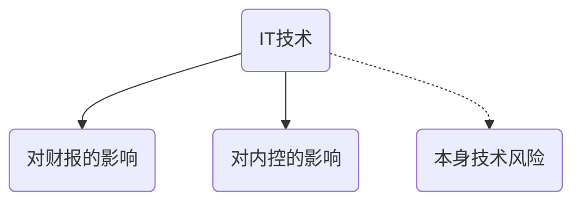

# 对内控影响

## 概念

扩展人类信息功能的技术

## 技术与财报的关系

1. 计算机输入输出代替手工记录
2. 电子显示代替纸质凭证
3. 电子文档代替了纸质的日记账
4. 网络通讯代替了邮寄
5. 管理需求固化到程序
6. 灵活的报告代替定期报告
7. 数据充分且实时共享
8. 系统问题比偶发性误差更普遍

有效的信息系统应当实现以下功能并保留记录

1. 识别和记录全部授权交易
2. 及时，详细记录交易内容，并在财报中适当分类
3. 衡量交易价值并在财报中提现相关价值
4. 确定交易的发生期间并将交易记录适当期间
5. 将相关信息在财报中做适当披露

## 对内控的积极影响

1. 有效处理大量交易数据
2. 不容易被绕过
3. 系统，数据库，操作系统能实现相关的职责分离
4. 提供信息的及时，准确性
5. 提高管理层对企业的监督管理水平

## 评估技术风险

### 内控目标

1. 提高管理层决策制定的效果和业务流程的效率
2. 提高会计信息的可靠性
3. 促进企业遵守法律

### 特有的技术风险

1. 可能对数据的错误处理
2. 系统，数据库，操作系统安全可能无效
3. 数据丢失风险
4. 不恰当的人工干预

# 知识点地图

