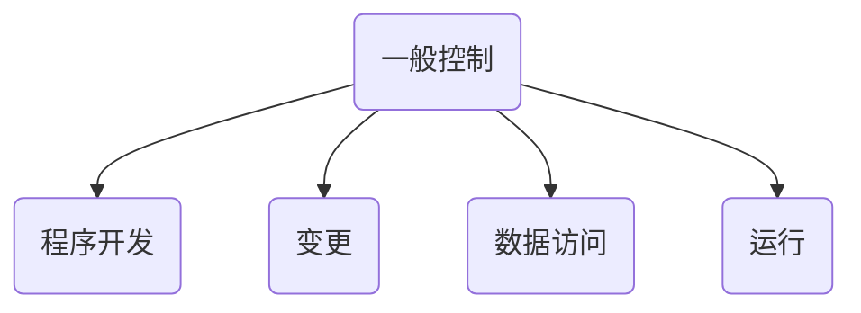
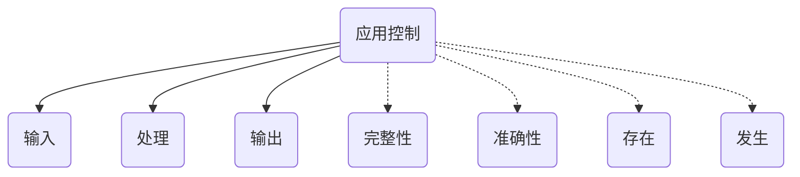
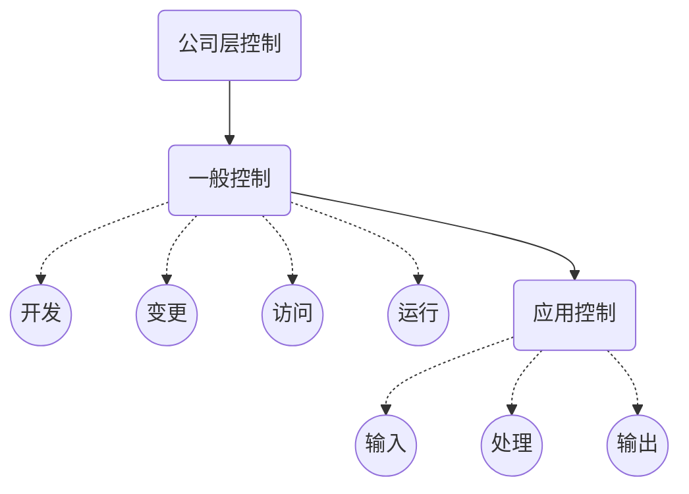

# 一般与应用控制

## 一般控制

​	信息技术的一般控制是指：为了保证信息系统安全，对整个信息系统以及外部各种环境要素实施的，对所有应用或控制具有普遍影响的控制措施。

### 程序开发

1. 管理方法论
2. 项目启动，分析和设计
3. 测试和质量保证
4. 数据迁移
5. 程序实施与应急
6. 流程更新和用户培训
7. 开发过程中的需求变更
8. 开发中职责分离

### 程序变更

1. 维护活动管理
2. 变更请求的规范，授权和跟踪
3. 测试和质量确保
4. 程序实施
5. 流程更新和客户培训
6. 变更过程的职责分离

### 数据访问

1. 应有用户授权管理
2. 高权限用户管理
3. 职责分离和权限管理
4. 认证和密码
5. 用户监控
6. 物理访问和环境控制
7. 网络访问控制

### 运行

1. 系统作业管理
2. 问题和故障管理
3. 数据备份和恢复
4. 备份介质的异地存放
5. 灾难恢复

## 应用控制

### 系统自动控制及应用控制审计关注点

1. 系统自动生成报告
2. 系统配置和科目映射
3. 接口控制
4. 访问和权限

## 公司层面信息技术控制

1. 信息技术规划的制定
2. 信息技术年度计划制定
3. 信息技术内审制度建立
4. 信息技术外部管理
5. 信息技术预算管理
6. 信息安全和风险
7. 应急预案
8. 系统架构和技术复杂度

## 一般控制+应用控制+公司层面控制联系

公司层面信息技术控制是整体控制环境，决定了风险基调；

一般控制是基础，直接影响应用控制是否值得信赖。

