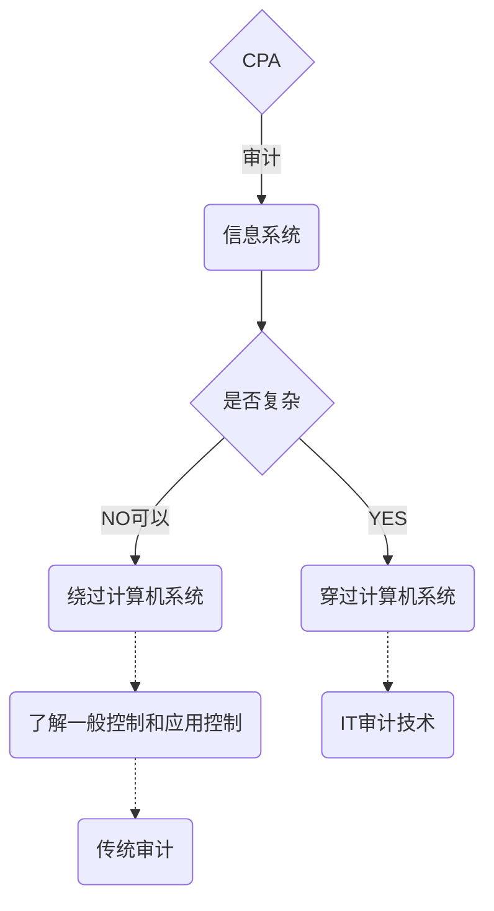

# 对审计影响

> ​	CPA ==计划依赖==自动控制或自动信息系统生成的信息，那么他们就需要适当==扩大==信息审计的范围。

**评估系统复杂度是，考虑**

1. 评估业务流程的复杂度
   1. 流程设计过多人员并相关人员之间关系复杂
   2. 设计大量操作及决策活动
   3. 数据处理过程涉及复杂公式和大量数据录入
   4. 需要对信息进行手动处理
   5. 对系统生成报告的依赖度
2. 评估信息系统的复杂度
   1. 被审计单位是否存在大量交易，以致用户无法识别与更正错报
   2. 数据是否通过网络传输
   3. 是否使用特殊系统
3. 技术环境的规模和复杂度

**CPA应当评价实际应用中存在的问题，对审计范围的影响**

1. 管理层如何获知与信息技术相关问题
2. 系统功能中是否发现有严重问题
3. 是否发生过信息系统运行出错
4. 内审报告是否提到过系统问题
5. 报告中提及的普遍系统问题是什么
6. 是否存在由于业务操作不规范，需要对数据库信息进行修改的情况
7. 操作者的能力，安全意识

> 在信息技术环境下，审计工作对系统的依赖程度是直接相关的。

> 了解内控有助于CPA识别潜在错报的类型和影响重大程度因素，对设计进一步审计程度的时间，性质和范围。

> 无论被审计单位运用信息技术的程度如何，CPA均需要了解与审计相关的信心技术的一般控制和应用控制。

## 一般控制对控制风险的影响

> 信息技术一般控制对应用控制有效性具有普遍性影响。

> 公司层面的信息技术控制是控制的环境，决定了信息技术的风险基调，CPA通常优先评价公司层和一般控制的有效性。

## IT控制对控制风险和实质性程序的影响

控制测试可以和具体审计目标向联系

一般控制，由于具有广泛性，CPA通常不将其和审计目标相联系。

