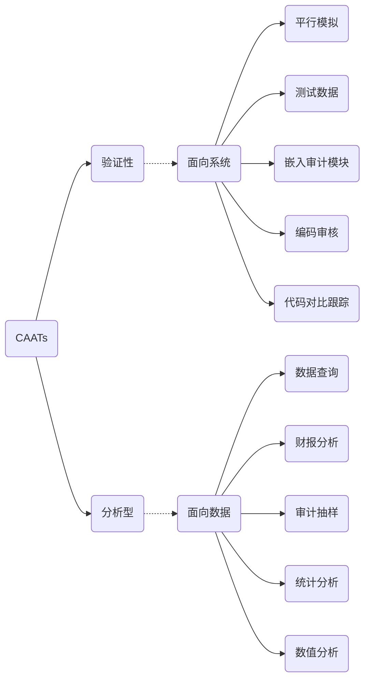

# CAATs运用

## CAATs?

运用计算机工具来实现审计自动化。

## 电子表格

利用计算机作为表格处理工具，以便实现制表，计算和结果综合的电子化软件。

​	因为电子表格非常容易被修改，并可能缺少控制活动，因此，电子表格面临着重大的风险和错报：

1. 输入错误
2. 逻辑错误
3. 借款错误
4. 其他错误

**电子表格控制内容**

1. 系统系统的一般控制
2. 嵌入在电子表格中的控制
3. 数据输入和输出的人工控制

