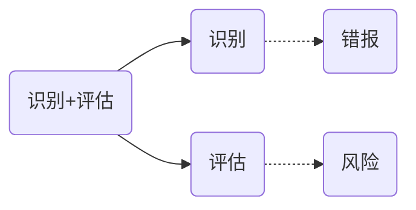

# 评估程序

## 评估程序和信息来源

> CPA应当实施以下程序来获取信息，评估重大错报风险。

**CPA 实施如下程序，了解被审计单位和环境**：

1. 询问管理层和单位内部人员
   1. 管理层所关注的主要问题
   2. 被审计单位最近财务状况，经营成果和现金流
   3. 可能影响财报的交易和事项
   4. 被审计单位发生其他重大变化
   5. 直接询问治理层
   6. 直接询问内审
   7. 询问直接参与生产，处理和记录复杂交易的人员
   8. 直接询问内部法律顾问
   9. 直接询问营销或销售人员，CPA为了解到的销售策略变化
2. 分析程序
   1. 针对财报数据之间和非财务数据的比较分析，来评估问题
3. 观察和检查（直接支持——>询问结果）
   1. 观察经营活动
   2. 检查文件，记录和内控手册
   3. 阅读有管理层和治理层编制的报告
   4. 实地观察别审计单位生产经营场所和产房设备
   5. 跟踪交易在财报的处理过程（穿行测试）

## 其他审计程序和信息来源

1. 阅读外部信息报告
2. 其他信息来源

## 项目组内部讨论

> 审计准则1211号规定：
>
> ​	项目合伙人和项目组内部关键成员应当讨论被审计单位财报主动存在的重大错报可能性，以及如何根据具体情况适用财报编制基础。
>
> ​	项目合伙人应当确定向未参与讨论的项目成员通告哪些事项。

1. 讨论目标
   1. 交流信息和风险见解
2. 讨论内容
   1. 面临的经营风险
   2. 财务容易出错的领域
   3. 舞弊
3. 参与讨论的人员
   1. CPA应当运用职业判断确定项目内部参与讨论的成员
4. 讨论时间和方式

# 知识点地图

