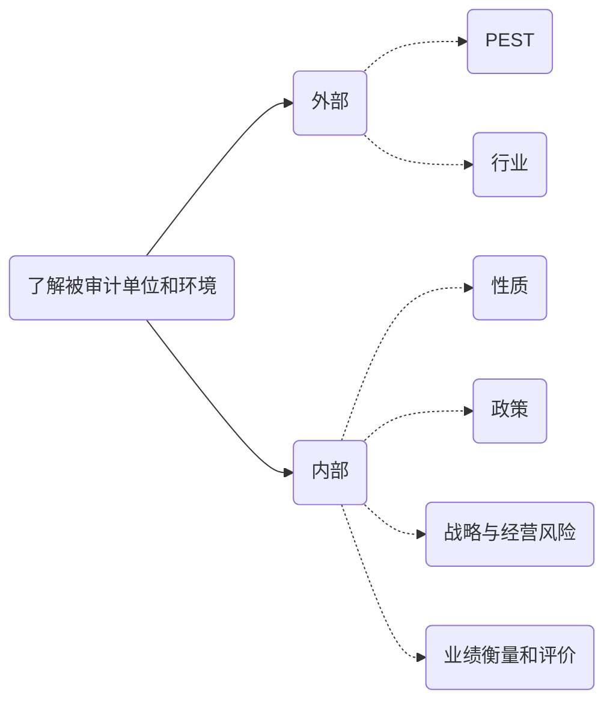

# 了解环境

## 总体要求

1. PEST
2. 被审计单位性质
3. 会计政策选择和应用
4. 目标，战略以及导致重大错报风险的经营风险
5. 财务业绩衡量与评价
6. 内控

## 行业，法律，监管环境

1. 行业
   1. 所处行业市场和竞争
   2. 季节性和周期性
   3. 相关生产技术
   4. 能源供应和成本
   5. 行业关键指标和统计
2. 法律监督环境
   1. 国家对行业是否有特殊监管
   2. 是否有新出台的新法规
   3. 国家货币，财政，税收和贸易政策变单位影响
   4. 相关税法是否变化
3. 其他
   1. 当前和预期宏观发展趋势
   2. 当地经济状况怎么影响单位经营活动
   3. 被审计单位经营活动是否受到全球化的影响
4. 了解重点和程度

## 被审计单位的性质

1. 所有权结构
2. 治理结构
3. 组织结构
4. 经营结构
   1. 主营性质
   2. 产品和服务相关信息
   3. 业务的开展
   4. 联盟，合营和外包
   5. 电子商务
   6. 地区和行业细分
   7. 生产设施
   8. 关键客户
   9. 货物和服务的重要提供商
   10. 劳动用工安排
   11. 研发收支
   12. 关联方
5. 投资活动
   1. 近期的并购与资产处置情况
   2. 证券投资，委托贷款发生和处置
   3. 资本性投资活动
   4. 不纳入合并范围的投资
6. 筹资活动
   1. 债务结构和条款
   2. 主要子公司和联营
   3. 实际受益者和关联方
   4. 衍生金融工具使用
7. 财报
   1. 会计政策和行业惯例
   2. 收入确认惯例
   3. 公允价值
   4. 外币资产，负债权益 
   5. 异常或复杂交易

## 对会计政策的选择和运用

1. 重大或异常交易处理
2. 缺乏权威标准的跨级政策影响
3. 会计政策变更
   1. 变更是否是法律要求的
   2. 变更是否提供了更可靠的信息
4. 新的准则要求
   1. 是否采用激进的会计政策，方法，估计和判断
   2. 财会人员的能力
   3. 是否有足够的资源支持

## 目标，战略和经营风险

1. 行业发展
2. 开发新产品或提供新服务
3. 业务扩张
4. 新的会计要求
5. 监管要求
6. 本期及未来的融资条件
7. 信息技术运用
8. 实施战略影响

**经营风险对对重大错报的影响**

**被审计单位的风险评估程序**

**对小型被审计单位的考虑**

## 财务业绩的衡量和评价

1. 了解主要方面
   1. 关键业绩指标
   2. 同期财务业绩分析
   3. 预算，预测，差异分析
   4. 员工业绩考核与激励
   5. 与竞争对手的比较
2. 关注内部业绩衡量的结果
3. 考虑财务业绩指标衡量的可靠性
4. 对小型企业的考虑

# 知识点地图

