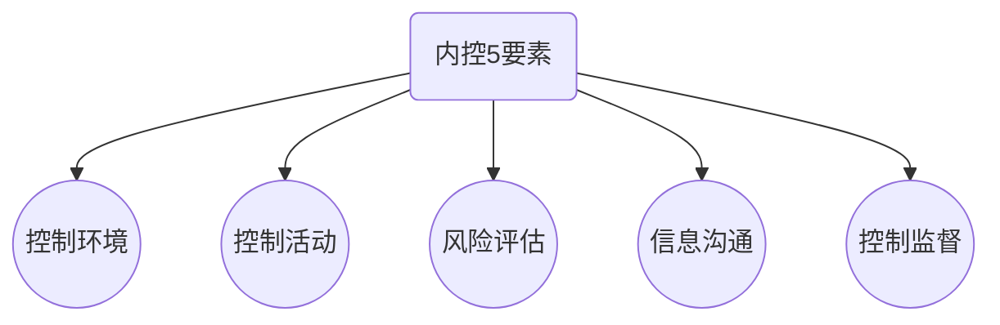

# 了解内控

## 内控？

1. 目标是合理保证

   1. 财报可靠性
   2. 经营效率和效果，以最优方式实现
   3. 遵守法律

2. 设计和实施内控责任主体是治理层和管理层

3. 实现内控目标的手段是设计和执行控制政策和程序

   1. 控制环境
   2. 风险评估过程
   3. 控制活动
   4. 信息沟通
   5. 监督

   **CPA可以分析使用不同框架和术语描述内控要素，但必须覆盖上述内控5要素。**

## 与审计相关的控制

> CPA需要了解和评价的内控只是与审计相关的，并非被审计单位所有的内控。

**判断内控是否与审计相关，应当考虑：**

1. 重要性
2. 相关风险重要性
3. 被审计单位规模
4. 被审计单位的性质
5. 被审计单位多样性和复杂性
6. 适用法律
7. 内控情况和使用要素
8. 作为内控组成部分的系统性质
9. 特定控制是否以及如何防止错报

## 对内控的了解深度

1. 评价控制设计

2. 获取控制设计和执行的证据

   1. 询问被审计单位人员
   2. 观察特定控制运用
   3. 检查文件和报告
   4. 追踪交易在财报系统中的处理（穿行测试）

   > 询问本身并不足以评价控制的设计以确定是否执行，CPA应当询问与其他风险评估程序结合使用。

3. 了解内控与测试内控有效性

## 内控人工和自动化

1. 考虑内控人工和自动化
2. 信息技术的优势及内控风险
   1. 优点
      1. 处理大量交易数据
      2. 提高信息及时性，可获得性和准确性
      3. 促进信息深入分析
      4. 提高管理层对经营情况的监督
      5. 降低控制被规避的风险
      6. 提高职责分离的有效性
   2. 技术风险
      1. 所依赖的系统未能正确处理数据
      2. 未经授权访问
      3. 技术员超权限访问
      4. 未经授权数据修改
      5. 未经授权改变系统
      6. 未经授权对程序作修改
      7. 不恰当的认为干预
      8. 数据丢失
   3. 人工控制的适用范围
      1. 存在大额，异常或偶发交易
      2. 难以界定，预计错误
      3. 针对变化，需要人工干预
      4. 监督自动控制有效性
   4. 人工控制带来的风险
      1. 人工控制可能更容易被规避
      2. 人工控制可能不具一贯性
      3. 人工控制可能更容易产生错误

## 内控局限性

1. 固有局限性
   1. 认为决策导致控制错误
   2. 管理层凌驾控制之上
2. 对小型企业的考虑

## 控制环境

1. 控制环境？
   1. 包括管理层和治理层的职能，管理层和治理层对内控的态度，认识和措施
2. 对诚信和道德价值的沟通和落实
3. 对胜任能力的重视
   1. 财务人员，系统人员的专业胜任能力
   2. 是否有足够的财务人员适应企业发展需要
   3. 财务人员的职业能力
4. 治理层参与程度
   1. 董事会是否建立审计委员会类似机构
   2. 审计委员会是否与内审和CPA沟通
   3. 董事会等专业委员会成员职业胜任能力
   4. 董事会等专业委员会是否独立于管理层
   5. 专业委员会的会议频率是否与具体业务相匹配
   6. 专业委员会是否参与制定编制财报过程
   7. 专业委员会是否对经营风险有足够的关注
   8. 董事会成员的稳定性
5. 管理层理念和风格
   1. 管理层是否对内控给予适当的关注
   2. 管理层是否有一个或几个控制，是否被有效监督
   3. 管理层风险偏好
   4. 管理层选择会计政策的风格
   5. 管理层对财务和系统技术人员职业能力是否有关注
   6. 对于重大会计事项，管理层是否与CPA沟通
6. 组织结构责权分离
   1. 内部是否有明确的职责划分
   2. 数据处理和管理职责划分是否合理
   3. 是否针对已经授权交易建立政策和程序
7. 人力资源政策与务实

## 被审计单位风险评估过程

1. 含义
   1. 监管与经营环境的变化
   2. 新员工加入
   3. 新信息系统使用
   4. 新技术
   5. 新产品
   6. 企业重组
   7. 海外经营
   8. 新会计准则
2. 对风险评估的了解
   1. 是否建立并沟通计划
   2. 是否建立风险评估过程
   3. 是否建立应对企业重大变化的机制
   4. 会计部门是否建立应对准则变化的机制
   5. 当变化来临，是否存在沟通渠道
   6. 风管部门是否建立应对环境变化带来的风险

## 信息系统与沟通

### 与财报相关的信息系统，通常具有如下职能：

1. 识别与记录所有有效的交易
2. 及时，详细描述交易，以便在财报中恰当分类
3. 恰当计量交易，以便对金额记录
4. 恰当确定交易的会计期间
5. 在财报中恰当列报交易

### CPA应当从如下方面了解信息系统：

1. 在经营过程中，对财报具有重大影响的各类交易
2. 在信息和人工系统中，交易记录的报告程序
3. 用于处理记录的特定账户
4. 被审计单位如何获取除交易外对财报有重大影响的事项
5. 财报编制过程
6. 与会计分录相关的控制

### 财报报告相关沟通

> 公开的沟通渠道有助于确保例外情况得到报告和处理。
>
> 沟通形式：
>
>  	1. 政策手册
>  	2. 会计和财报报告手册
>  	3. 备忘录
>  	4. 电子，口头沟通
>  	5. 管理层的行动

### 对财报相关的沟通了解

1. 管理层就员工职责和责任控制是否进行有效沟通
2. 针对可疑不恰当事项和行为是否建立了有效的沟通渠道
3. 组织内部的沟通的充分性是否能使人员有效履行职责
4. 对客户，供应商，监管者和其他外部人士沟通，管理层是否采取进一步行动
5. 被审计单位是否收到监管要求的约束
6. 外部人士多大程序上获知内部行为手册

## 控制活动

1. 含义

   1. 授权（一般授权+特别授权）
   2. 业绩评价
   3. 信息处理（一般控制+应用控制）
   4. 实物控制
   5. 职责分离

2. 对控制活动的了解

   1. 被审计单位是否有必要的控制政策和程序
   2. 管理层是否在预算，利润其他经营方面有清晰的目标，并积极监控
   3. 是否有计划和报告系统，针对识别出与目标业绩差异并及时报告管理层
   4. 针对差异，是否有适当的管理层进行调查并纠正
   5. 职责分离的程度
   6. 会计系统数据是否和实物资产定期核对
   7. 是否建立保护措施，以防止未经授权的文件接触
   8. 是否存在信息安全部门负责安全政策和程序

   ## 控制的监督

   ### 了解内控监督

   1. 管理层是否定期评价内控
   2. 被审计单位人员执行正常职责，能在多大程度上获取控制有效的证据
   3. 与外部沟通能在多大程度上证实存在的问题
   4. 管理层是否采纳内审和CPA意见
   5. 管理层是否及时纠正了偏差
   6. 管理层根据监管机构是否及时纠正偏差
   7. 是否存在协助管理层监督的内部职能部门
      1. 独立性和权威性
      2. 向谁报告
      3. 是否有足够人员及胜任能力
      4. 是否坚持适用的专业准则
      5. 活动的范围
      6. 计划，评估，执行记录形成结论的适当性
      7. 是否不承担经营管理责任

## 从总体和业务层面了解内控

1. 确定重要业务流程和重要交易类型

2. 了解重要的交易流程并记录

   1. 输入信息来源
   2. 所适用的重要数据档案
   3. 重要的处理程序
   4. 重要的输出文件
   5. 基本的职责划分

3. 确定可能发生的出错环节

4. 识别和了解相关控制

   1. 预防性控制（事前）
   2. 检查性控制（事后）

5. 执行穿行测试，证实交易流程和相关控制的了解

   1. 确认对业务流程的了解
   2. 确认对重要交易的完整性
   3. 确认获取的预防性控制和检查性控制的准确性
   4. 评估控制设计的有效性
   5. 确认控制是否得到执行
   6. 确认之前所做书面记录的准确性

6. 初步评价和风险评估

   1. 对控制的初步评价
      1. 控制能够防止并纠正重大错报，并得到执行
      2. 本身设计合理，但没有执行
      3. 本身审计无效或缺乏
   2. 风险评估考虑因素
      1. 账户特征以及识别的重大错报风险
      2. 被审计单位整体层面控制评价

7. 对报告流程的了解

   1. 将业务数据汇总计入总账
   2. 总账生产，记录，处理会计分录程序
   3. 记录财报常规和非常规调整程序
   4. 草拟财报和披露程序

   > 在了解财报流程中，CPA应当考虑如下方面做出的评估：
   >
   > 1. 主要信息输入，执行，主要信息输出
   > 2. 财报流程中设计IT技术的程度
   > 3. 管理层那些人员参与其中
   > 4. 记账分录的主要类型
   > 5. 适当的人员

# 知识点地图

