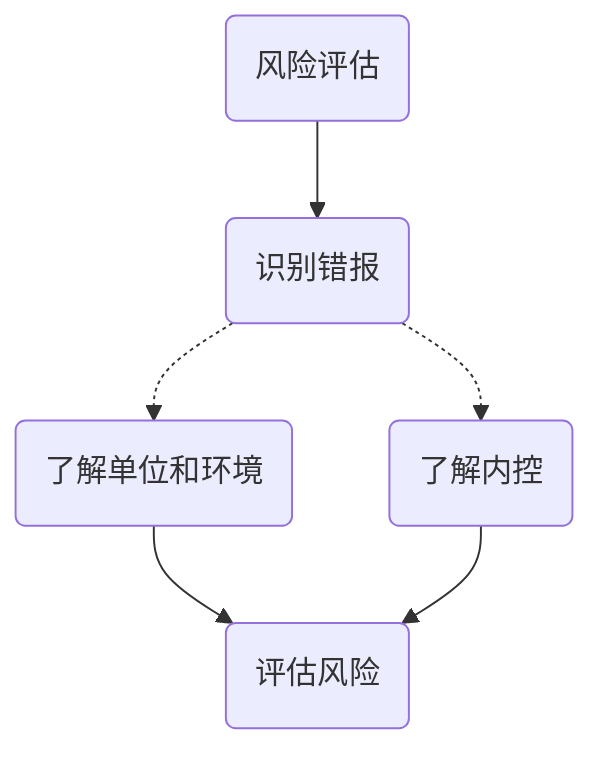
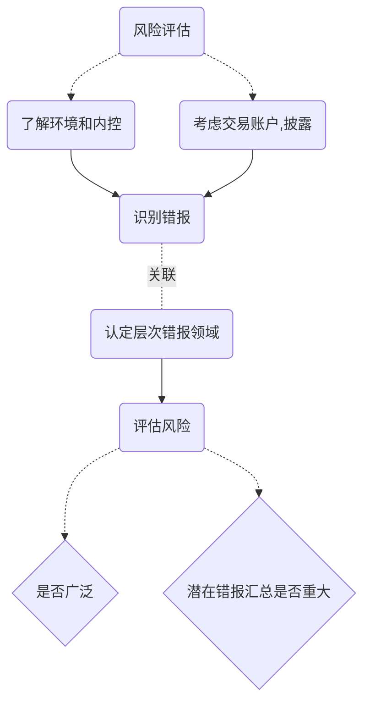

# 评估风险

**风险评估流程：**

## 评估报表层和认定层重大错报风险

1. 考虑因素

| 1.已经识别的风险是什么？ |                        |
| ------------- | ---------------------- |
| 财报层面          | 1. 被审计单位薄弱的内控环境和IT技术控制 |
|               | 2. 与财报整体相关的广泛性特别风险     |
|               | 3. 管理层凌驾控制之上           |
|               | 4. 管理层愿意接受的风险          |
| 认定层           | 1. 与完整，准确，存在，计价相关的特定风险 |
|               | 2. 多重错报风险              |
| 相关的内控         | 1.  特别风险               |
|               | 2. 用于防止并发现而设计的内控       |
|               | 3. 仅通过控制测试应对的风险        |

| 2. 错报金额可能发生多大规模？ |                    |
| ---------------- | ------------------ |
| 报表层次             | 什么事项可能导致重大错报？凌驾，舞弊 |
| 认定层次             | 1. 交易，账户余额固有性质     |
|                  | 2. 日常和例外事项         |
|                  | 3. 以往经验            |

| 3.事件发生的可能性多大？ |                         |
| ------------- | ----------------------- |
| 财报层面          | 1. 来自高层基调               |
|               | 2. 管理层风险管理方法            |
|               | 3. 采用的政策                |
|               | 4. 以往经验                 |
| 认定层次          | 1. 相关控制活动               |
|               | 2. 以往经验                 |
| 相关控制          | 识别用于降低事件发生可能性关键的管理层风险应对 |

2. 评估重大错报风险的审计程序
   1. 在了解被审计单位和环境的基础上，结合财报账户交易，综合考虑==识别==风险
   2. 结合拟测试的控制考虑，将识别的风险==和认定层次相关联==
   3. 评估识别的风险并评价其==广泛性==
   4. 考虑发生错报的可能性，以及==潜在错报==导致重大错报的可能性

3. 识别两个层次的重大错报风险
4. 控制环境对评估报表层次重大错报风险的影响

> 财报报表层次的错报风险很可能源于薄弱的控制环境。

5. 控制对评价认定层次重大错报风险的影响
6. 考虑财报可审计性

当CPA对内控了解后，针对财报的可审计性产生疑问，CPA应当出具保留意见或无法表示意见的审计报告。

1. 会计记录的可靠性存在重大问题，不能获取充分，适当的证据。
2. 对管理层的诚信产生严重疑虑

## 需要特别考虑的重大错报风险

###确定特别风险，考虑因素：

1. 风险是否属于舞弊
2. 风险是否与近期环境，会计处理方法重大变化相关
3. 交易复杂程度
4. 风险是否涉及重大关联方交易
5. 财报信息计量的主观程度
6. 风险是否涉及异常或超出正常经营范围

### 非常规交易和判断事项导致的特别风险

1. 与重大非常规交易相关的错报风险
   1. 管理层过多的干预会计处理
   2. 数据收集处理更多人工干预
   3. 复杂的计算和处理
   4. 非常规交易可能导致管理层难以有效控制
2. 与重大判断有关的错报风险
   1. 会计估计，收入确认方面原则理解不同
   2. 判断的主观和复杂
3. 考虑与特别风险相关的控制

## 仅仅通过实质性程序无法应对的重大错报风险

> ​	如果认为仅仅通过实质性程序无法应对重大错报风险，CPA应当评价被审计单位针对这些风险设计的控制，并确认其执行情况。

## 对风险评估的修正

> ​	评估重大错报风险与了解被审计单位环境一样，也是一个连续动态，收集，更新和分析信息的过程，贯穿与审计的整体过程。

# 知识点地图

