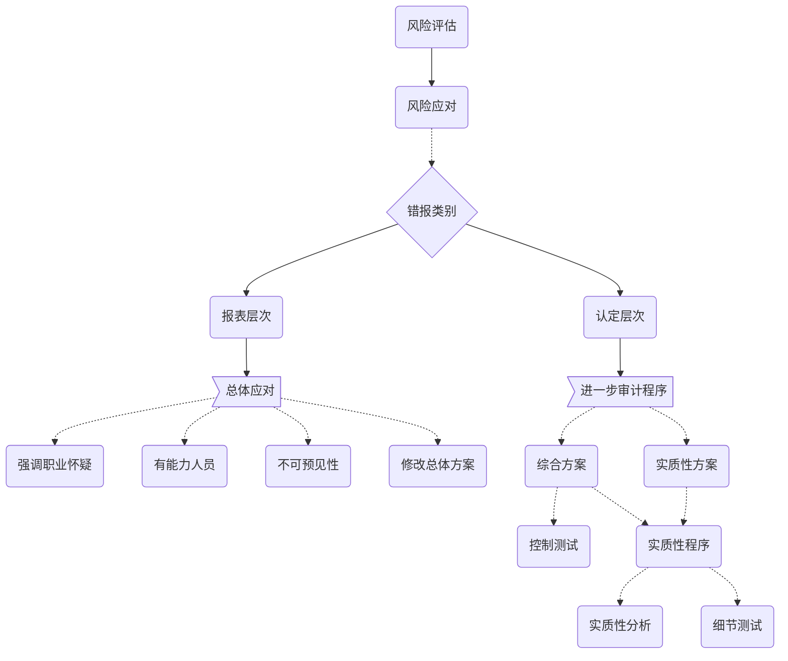

# 报表层次应对

## 应对财报报表层次错报

1. 向项目组强调保持职业怀疑必要性
2. 指派更有经验或具有特殊技能的审计人员或利用专家
3. 提供更多的督导
4. 在进一步审计程序中，融入不可预见性措施
   1. 提高不可预见性措施
      1. 针对未测试过且风险小金额少的账户进行测试
      2. 调整审计程序的时间
      3. 采取不同的审计抽样方法
      4. 选取不同地点实施审计程序
5. 对拟实施程序的性质，时间和范围作出总体修改
   1. 在期末而非其中实施更多的审计程序
   2. 通过实施实质性程序来获取更加广泛的证据
   3. 增加拟纳入审计范围的经营地点数量

## 增加不可预见性的方法

1. 增加审计程序的不可预见性思路
2. 增加审计程序不可预见性的事实要点
   1. CPA需要和管理层事先沟通，要求实施不可预见性程序，但不告知具体内容
   2. 通过对舞弊风险的评估来确定不可预见性的审计程序
   3. 项目合伙人需要安排组员实施不可预见性程序，但同时要避免将组员陷入困难境地

# 知识点地图

**风险应对的层次**

