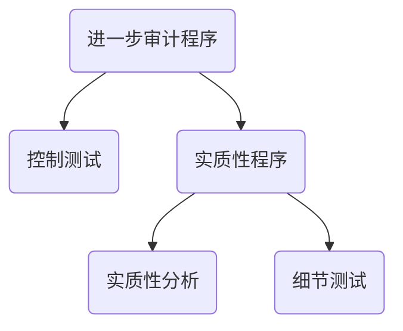
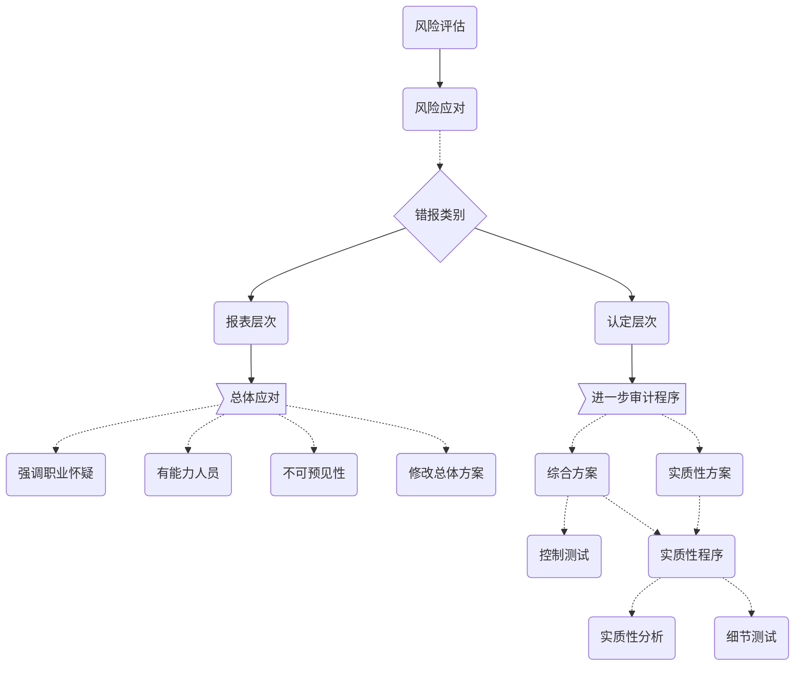

# 认定层次应对

## 进一步审计程序考虑因素

1. 风险重要性
2. 重大错报发生可能性
3. 涉及各类交易，账户和披露
4. 被审计单位采用的特定控制的性质
5. CPA是否拟获取证据，确定内控有效

## 进一步审计程序

###进一步审计的类型

### 进一步审计的时间选择

> CPA可以在期中或期末实施控制测试或实质性程序。

选择时间，应当考虑因素：

1. 控制环境
2. 何时能得到相关信息
3. 错报风险性质
4. 审计证据适用的期间或时点

### 进一步审计的范围

1. 确定重要性水平
2. 评估重大错报风险
3. 计划获取保证的程序

# 知识点地图

