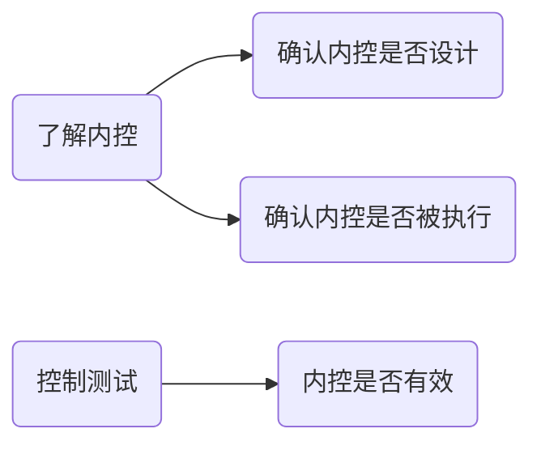
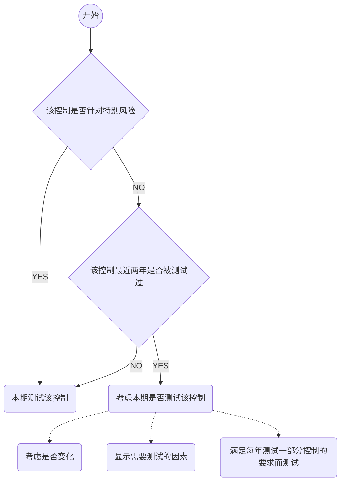

# 控制测试

## 了解内控与控制测试的区别

## CPA应当获取内控如下有效的证据

1. 控制在所审计期间相关时点如何运行
2. 控制是否得到一贯执行
3. 控制由谁或以何种方式执行

## 控制测试的要求

当在下列情况下，CPA应当控制测试：

1. 在评估阶段，任务控制有效
2. 仅仅实施实质性程序无法获取充分，适当的证据

> ​	如果被审计单位在所审计期间内不同的时期使用了不同的控制，CPA应当考虑不同的时期控制运行的有效性。	

## 控制测试的性质

1. 询问

   1. > ​	虽然询问是一种有用的手段，但他必须和其他测试手段结合使用，才能发挥作用。询问过程中，CPA应当保持职业怀疑。

2. 观察（没有留下轨迹）

3. 检查（留下轨迹）

4. 重新执行

### 确定控制测试的性质和要求

1. 考虑特定控制的性质
2. 考虑测试与认定直接相关和间接相关的控制
3. 如何对一项自动化应用控制实施控制测试

### 实施控制测试时对双目的的实现

控制测试+细节测试

### 实施实质性程序的结果对控制测试结果的影响

## 控制测试的时间

1. 何时实施控制测试
2. 测试所针对时点与期间

### 如何考虑其中审计证据

1. 获取这些在剩余期间发生重大变化的审计证据
2. 确定剩余期间还需补充的审计证据
   1. 评估认定层次重大错报风险的重要性
   2. 在其中测试的特定控制测，以自其中测试后发生重大变化
   3. 在其中对有关控制运行有效性取得审计证据的程度
   4. 剩余期间的长度
   5. 在信赖控制的基础上拟缩小实质性程序的范围
   6. 控制环境

### 如何考虑以前审计获取的审计证据

1. 基本思路
   1. 考虑拟信赖以前审计中测试的控制在本期是否发生变化
2. 当控制在本期发生变化时候CPA的做法
   1. 考虑以前获取有关控制有效性审计证据是否和本期审计相关
3. 当控制在本期未发生变化时候CPA的做法
   1. 如果拟信赖控制自上次测试后未发生变化，且不属于旨在减轻特别风险的控制，CPA应当运用职业判断确定是否在本期审计中测试期运营有效性，以及本次测试与上次测试的时间间隔，每三年至少一次
   2. 在确定利用以前测试有效性证据是否适当以及再次测试时间间隔，CPA应当考虑：
      1. 内控其他要素的有效性
      2. 控制特点
      3. 信息技术一般控制有效性
      4. 影响内控重大人事变化
      5. 由于环境变化而特定控制缺乏相应的变化导致风险
      6. 重大错报风险和对控制的信赖程序
4. 不得信赖以前审计所获取的证据的情形

旨在减轻特别风险的控制,CPA都不应当信赖以前的证据。

## 控制测试的范围

1. 确定控制测试范围的因素
   1. 拟信赖期间
   2. 在所审计期间
   3. 控制的预期偏差
   4. 通过测试与认定相关的其他控制获取的审计证据范围
   5. 拟获取有关认定层次控制运营有效性审计证据的相关性和可靠性
2. 对自动化控制测试范围的特别考虑

> 信息技术处理具有内在的一贯性，除非系统发生变动，一项自动化应用控制应当一贯执行。

 	1. 测试与该应用控制有关的一般控制和运行有效性
 	2. 确定系统是否发生变动，如果发生变化，是否存在适当的系统变动控制
 	3. 确定对交易的处理是否使用授权批准的软件版本

# 知识点地图

