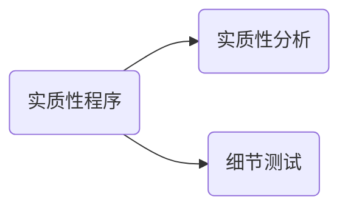

# 实质性分析



1. 将财报与所依据的会计记录进行核对和调节
2. 检查财报编制基础过程中作出的重大会计分录和其他调整

> ​	由于CPA对重大错报风险的评估是一种判断，可能无法充分识别所有的错报风险，且由于内控存在固有局限性，无论评估的重大错报风险结果如何，CPA都应当针对所有重大类别交易，账户余额和披露实施实质性程序。

### 针对特别风险实施实质性程序

> ​	如果认为评估的认定层次重大错报风险是特别风险，CPA应当专门针对实施实质性程序。

## 实质性程序的性质

1. 细节测试和实质性分析程序的适用性

   1. ```mermaid
      graph LR
      	a(实质性分析)-->a1(一段时间内可预期关系的大量交易)
      	b(细节测试)-->b1(存在发生计价领域)
      ```

2. 细节测试的方向

3. 设计实质性程序考虑因素

   1. 对特定认定使用实质性分析程序的适当性
   2. 对已经记录的金额比率作出预期，所依据内外信息的可靠性
   3. 预期的准确性能否在计划的保证程度上识别错报
   4. 已经记录金额和预期差异的可接受差异额

## 实质性分析的时间

### 如何考虑是否在其中实施实质性程序

1. 控制环境和其他相关控制
2. 实施审计程序所需要信息其中之后的可获得性
3. 实质性程序的目的
4. 评价重大错报风险
5. 特定类别交易以及相关认定的性质
6. 针对剩余期间

### 如何考虑其中的审计证据

1. 针对剩余期间实施进一步审计程序
2. 将实质性程序和控制测试结合使用

### 如何考虑以前审计获得证据

## 实质性程序的范围

# 知识点地图

