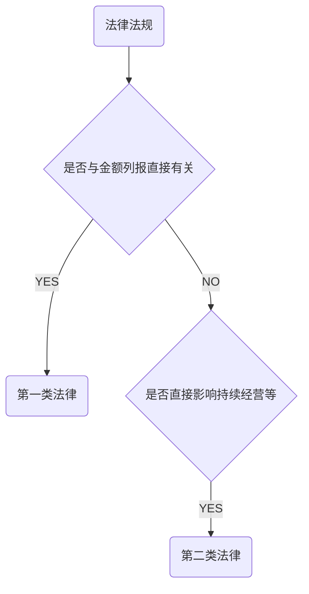

# 法律考虑

> ​	违反法律法规，是指被审计单位有意或无意违背除适用的财报编制基础之外的的现行的法律法规的行为。

> 违法法律法规不包括：治理层。管理层，员工个人违反法律法规的个人行为。

**被审计单位应当遵守以下两类法规**

1. 对决定财报中重大金额和披露有直接影响的法规。
2. 对决定财报金额和披露无直接影响，但对经营活动，持续经营能力或大额罚款至关重要的法律。

## 管理层遵守法律责任

> 管理层有责任在治理层的监督下确保被审计单位经营活动符合法律的规定。

## CPA的责任

> CPA有责任对财报整体不存在由于舞弊或错误导致错报获取合理保证。

### 加大审计固有限制的情况

1. 许多法律法规与被审计单位的经营活动有关，通常不影响财报，不能被系统获取
2. 违法法律可能涉及故意隐瞒行为
3. 某行为是否构成违法，最终只能有法院认定

> CPA没有责任防止被审计单位违法行为，也不能期望发现所有的违法行为。

### CPA针对两类法律的责任

1. 针对第一类法律，CPA有责任获取被审计单位遵守法律法规的充分，适当的审计证据
2. 针对第二类法律，CPA仅限于实施特定程序，有助于识别可能的违法行为

## 对被审计单位最受法律的考虑

1. 对法律框架的了解
   1. 了解所处行业法律框架
   2. 被审计单位如何遵守法律框架的
2. 针对直接影响金额的法律法规
   1. 财报格式和内容
   2. 特定行业财报问题
   3. 政府合同对交易会计处理
   4. 所得税费用或退休金成本确认
3. 识别违反其他法律行为的程序
   1. 向管理层和治理层询问被审计单位是否遵守了法律
   2. 检查被审计单位许可证颁发机构往来文件
4. 实施其他程序识别
   1. 阅读会议纪要
   2. 向管理层，内部或外部法律顾问询问诉讼，索赔情况
   3. 对某些交易，账户余额和披露实施细节测试
5. 书面申明

## 应对识别出违法行为的审计程序

1. 可能违法事项
   1. 收到监管机构，政府部门处罚
   2. 向未指明服务付款，向顾问，关联方贷款
   3. 与被审计单位或所处行业正常支付水平相比，支付费用过多
   4. 采购价格显著高或低于市价
   5. 异常的现金支付
   6. 与避税天堂注册公司交易
   7. 向货物产地以外的地区付款
   8. 在没有适当交易记录控制的情况下付款
   9. 现在的信息系统无法提供充分证据
   10. 未授权的交易
   11. 负面的媒体评论
2. 应对方法
   1. 了解违法性质和环境
   2. 获取进一步信息，评价财报可能产生的影响
      1. 违法行为对财报的潜在影响
      2. 潜在财务后果是否需要列报
      3. 潜在财务后果是否严重
3. 怀疑存在违法行为的应对
   1. 如果治理层提供额外的审计证据，CPA可以与治理层讨论其发现
4. 评价违法行为的影响

## 对识别或怀疑违法行为的报告

1. 与治理层沟通
   1. 总体要求
      1. 除非治理层参与管理，否则CPA应当与治理层沟通有关违法事项，但不必沟通明显不重要的事项
   2. 违法行为情节严重时的沟通要求
      1. 对故意和重大违法行为沟通要求（尽快与治理层通报）
      2. 怀疑违法行为的要求（如果涉及管理层和治理层，CPA向审计委员会或监事会，没有咨询法律意见）
2. 出具报告
   1. 考虑违法行为影响
   2. 考虑审计范围限制
      1. 来自被审计单位限制
      2. 其他条件限制
3. 向监管或执法机构报告

# 知识点地图

