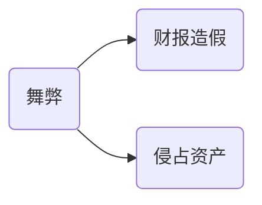

# 舞弊与法律

## 舞弊？

> 舞弊是指被审计单位的管理层，治理层，员工或第三方用欺骗手段获取不正当利益的故意行为。

## 舞弊分类

### 管理层财报造假方式

1. 对会计记录或支持性文件凭证造假
2. 财报列示中故意错误或漏记事项
3. 故意错误使用金额，分类，列示等会计原则

### 侵占资产方式

1. 贪污收到的款项
2. 盗窃实物资产或无形资产
3. 使被审计单位对未收到的商品或未接受的劳务付款
4. 挪用资产

## 治理层，管理层与CPA的责任

1. 治理层，管理层责任
   1. 被审计单位治理层和管理层对防止或发现舞弊负有主要责任。
2. 有效防止舞弊的三方面
   1. 营造和保持诚信，道德的文化
   2. 评估舞弊风险并实施以控制，化解风险
   3. 建立适当的舞弊监督程序
3. CPA责任
   1. 按照审计准则规定执行审计工作，CPA有责任对财报整体不存在由于舞弊或错误导致的重大错报获得合理保证
   2. 按照审计准则执行审计工作后，由于审计的固有限制，也不免存在CPA无法发现的错报，CPA无法提供绝对保证。

## 风险评估相关活动

1. 询问
   1. 对象
      1. 不直接参与财报过程的人员
      2. 拥有不同级别权限的人员
      3. 参与生产，处理货记录复杂或异常交易的人员
      4. 负责道德事务的主管
      5. 负责处理舞弊指控的人员
   2. 内容
      1. 管理层对财报可能存在舞弊导致错报的风险评估
      2. 管理层针对舞弊的识别和应对过程
      3. 管理层针对舞弊识别向治理层的通报
      4. 管理层的经营理念和道德观念的通报
2. 评价舞弊的风险因素
   1. 实施舞弊的动机或压力
   2. 实施舞弊的机会
   3. 舞弊接口或态度
3. 实施分析程序
4. 考虑其他信息
5. 组织内讨论
   1. 较多经验人员分享
   2. 针对舞弊高风险领域的针对措施与程序
   3. 确定如何在项目组内分享审计结果
   4. 讨论内容
      1. 组内人员认为容易发生错报舞弊的领域
      2. 可能表明管理层操作利润的迹象
      3. 已经知悉对被审计单位产生影响的外部和内部因素
      4. 对容易接触现金的岗位人员，管理层的措施
      5. 注意到管理层生活方式的异常
      6. 强调审计过程中保持应有关注的必要性
      7. 遇到的那些情况肯能表明舞弊
      8. 如何在审计程序中增加不可预见性
      9. 为应对舞弊而设计的应对程序
      10. CPA注意到的舞弊指控
      11. 管理层凌驾控制之上的风险

## 识别和评估舞弊风险

> 舞弊导致的风险是特别风险，需要CPA特别考虑。

## 应对舞弊

1. 总体应对措施
   1. 选派更有经验的组员执行舞弊高风险领域审计工作
   2. 评估管理层对会计政策的选用
   3. 增加审计程序的不可预见性
2. 针对认定层次的审计程序
   1. 改变审计程序的性质
   2. 改变实质性程序的时间
   3. 改变审计程序的范围
3. 针对管理层凌驾控制之上的审计程序
   1. 管理层凌驾的手段
      1. 编制虚假会计分录
      2. 滥用会计政策
      3. 不恰当的调整会计估计
      4. 故意漏记，提前确认交易事项
      5. 隐瞒交易事项
      6. 构造复杂或虚假的财报数据
      7. 篡改与重大异常交易的会计分录
   2. CPA应对措施
      1. 会计分录测试
         1. 询问参与报告过程的人员
         2. 选择在期末做出的分录和调整
         3. 考虑是否有必要测试整个会计期间的分录和调整
      2. 复核会计估计是否存在偏向
         1. 评价管理层对会计估计的偏向
         2. 追溯复核以前年度管理层对估计的假设
      3. 针对超出被审计单位经营的重大交易，评价商业合理性
         1. 交易形式显得过于复杂
         2. 管理层未就交易性质和治理层讨论，缺乏记录
         3. 管理层强调使用某种特定的处理，而不是交易的实质
         4. 针对未纳入合并范围的企业，未经治理城审核和批准
         5. 交易涉及以前未识别出的关联方

## 会计分录测试

1. 会计分录和其他调整
   1. 标准会计分录
   2. 非标准会计分录
   3. 其他调整
2. 分录测试步骤
   1. 了解被审计单位报告流程
   2. 确定待测试会计分录其他调整的总体和完整性
   3. 从总体选取待测试分录
   4. 测试选取的分录与调整
3. 被审计单位自身控制中针对会计分录和调整的
   1. 针对分录和其他调整授权，过账，审核，核对等职责分离
   2. 设置访问权限，分离记录权和访问权
   3. 用以发现虚假分录未授权的措施
   4. 由治理层，管理层或其他适当人员对分录和调整的监督
   5. 被审计单位内审的定期测试
4. 确定总体的完整性的考虑
   1. 某些会计分录可能未列入总账
   2. 可以结合了解财报报告流程和确定总体完整性
   3. 手工方式生产的记录的核对
   4. 关注手工生产的期末分录
5.  选取并测试会计分录和其他调整的考虑因素
   1. 对由于舞弊导致的错报的评估
   2. 对会计分录和其他调整的实施控制
   3. 报告过程和所能获取的证据性质
   4. 虚假会计分录的特征
      1. 涉及不相干，很少用的账户
      2. 由平时不负责做出会计分录人员做出
      3. 在期末或结账过程做出，且解释很少
      4. 在编制财报之前或过程中作出且没有科目代码
      5. 分录金额约整
   5. 账户性质和复杂程序
      1. 包含错误或性质异常的账户
      2. 包含重大估计和期末错报的账户
      3. 过去容易错报的账户
      4. 未及时调整的账户
      5. 包含集团内部不同公司间的账户
      6. 其他

## 评价审计证据

## 无法继续执行审计

1. 对继续执行审计业务能力的怀疑
   1. 确定具体情况下的职业责任和法律责任
   2. 法律允许条件下，考虑是否需要解除业务约定
   3. 产生怀疑的情况
      1. CPA任务必要的错误，但是被审计单位没有适当的针对舞弊的该类措施
      2. CPA任务错报风险重大且广泛
      3. CPA对管理层和治理层诚信产生重大疑虑
2. 解除业务约定
   1. 与适当的管理层和治理层讨论解除约定的决定和理由
   2. 考虑是否存在法律或职业责任，向委托人或监管机构报告

## 书面申明

1. 当舞弊性质和CPA执行工作遇到困难，管理层书面申明应作出如下保证
   1. 管理层对财报可能存在重大错报风险的评估结果
   2. 对影响被审计单位舞弊实施与指控的了解程度
2. CPA应当就下列事项获取书面申明
   1. 管理层和治理层认定设计，执行和维护内控防止和发现舞弊的责任
   2. 管理层和治理层已经向CPA披露了管理层作出的评估结果
   3. 管理层和治理层已经向CPA披露涉及在内控中承担重要职责人员的舞弊嫌疑
   4. 管理层和治理层已经向CPA披露了从现任和前任，分析师，监管者获知的影响财报舞弊的嫌疑

## 和管理层和治理层和监管机构沟通

1. 与管理层沟通
   1. 当CPA已获取证据表明可能存在舞弊，尽快提请适当层级管理层注意
2. 与治理层沟通
   1. 当确定或怀疑设计舞弊的是管理层，CPA应当就此情况与治理层沟通
3. 与监管机构沟通

# 知识点地图

