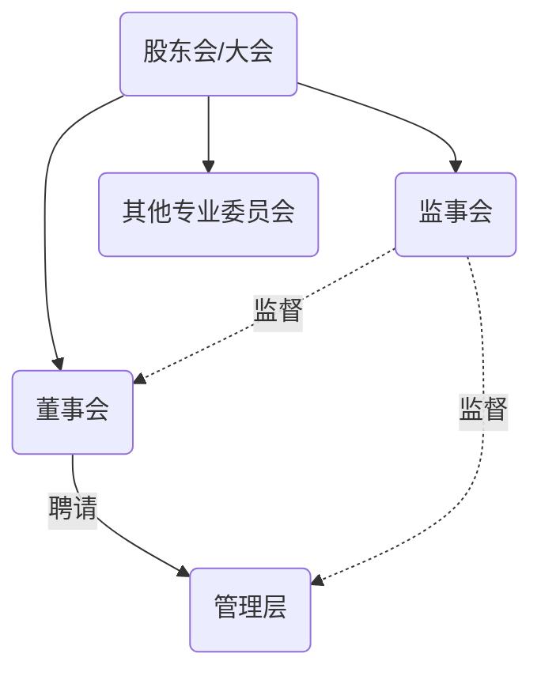

# CPA与治理层

**公司治理结构**

**治理层与CPA有效双向沟通的作用**

1. 有助于CPA保持独立性和客观性
2. 有助于CPA向治理层获取审计信息
3. 治理层履行监督责任，有效降低错报风险

**CPA与治理层沟通的主要目的**

1. 就审计范围，时间和管理层，治理层沟通责任，取得相互了解
2. 及时向治理层告知与治理层相关的责任
3. 共享有助于CPA获取审计证据的其他信息

## 沟通对象

1. 总体桥求
   1. 确定沟通对象一般要求
      1. 确定适当的沟通人员
      2. 确定沟通人员时应当利用的信息
   2. 需要商定沟通对象的特殊情况
2. 与治理层下设组织或个人沟通
   1. 决定与治理层下设组织或个人沟通应考虑因素
      1. 下设组织和治理层的责任
      2. 拟沟通事项性质
      3. 相关法律要求
      4. 下设组织是否有权就沟通信息采取行动
   2. 被审计单位审计委员会情形
      1. 邀请CPA定期参与审计委员会会议
      2. 审计委员会人员定期与CPA联系
      3. 审计委员会每年至少一次在管理层不在场情况下，与CPA沟通
   3. 需要和治理层整体沟通的特殊情形

## 沟通的事项

1. CPA与财报审计责任
   1. CPA对财报形成并发表意见
   2. 审计并不能减轻管理层和治理层责任
2. 计划审计范围和时间安排
   1. 帮助治理层了解审计工作
   2. 帮助CPA更好了解被审计单位环境
      1. CPA拟如何应对由于舞弊导致特别风险领域
      2. CPA对于审计相关内控采取方案
      3. 在审计中重要性概念的运用
      4. 实施计划所需要的专业技术和性质程度
      5. 其他沟通事项
         1. 利用内审人员
         2. 治理层对下列问题的看法
            1. 与被审计单位治理结构中那些人员沟通
            2. 治理层和管理层之间的责任分配
            3. 被审计单位目标和战略
            4. 治理层认为审计过程中应当注意的领域
            5. 与监管机构的重要沟通
            6. 治理层认为可能影响财报的其他事项
         3. 治理层对下列问题的态度，认识和措施
            1. 内控的重要性
            2. 舞弊发生的可能性和如何应对
         4. 治理层应对会计准则变化的措施
         5. 治理层对以前与CPA沟通作出的反应
   3. 审计中的重大发现
      1. CPA对会计实务重大方面的看法
      2. 审计工作中的重大困难（发表非无保留意见）
         1. 管理层在提供所需证据的严重拖延
         2. 不合理的要求缩短完成审计的工作时间
         3. 为获取充分，适当审计证据需要付出努力远远超过预期
         4. 无法获取预期信息
         5. 管理层对CPA的限制
         6. 管理层不愿意延长持续经营期
      3. 已经和管理层沟通或需要书面申明
         1. 影响被审计单位环境，可能导致错报的经营计划和战略
         2. 对管理层对会计，审计问题向其他专业人士咨询的关注
         3. 管理层在首次委托书面申明
      4. 影响审计报告形式的情况
      5. 审计发现，根据职业判断对监督财报过程中重大其他事项
   4. 值得关注的内控缺陷
      1. 缺陷
         1. 某项控制设计，执行不能防止错报
         2. 缺乏控制
      2. 向治理层和管理层通告内控缺陷
         1. 已向或拟向治理层关注的内控缺陷
         2. 审计中识别出，但其他方为通报，CPA任务重大的其他缺陷
   5. CPA的独立性
      1. 对独立性的不利影响
      2. 法律法规和职业规范的措施
   6. 上市实体额外沟通事项
      1. 针对组员，事务所和网络所得独立性声明
      2. 职业判断被审计单位，事务所，网络所可能影响独立性的其他事项
      3. 为消除对独立性不利影响的应对措施
   7. 补充事项
      1. 识别和沟通这类事项的审计目的，只是附带的
      2. 除对财报发表意见的审计程序外，没有专门针对的其他程序
      3. 没有实施其他程序确定是否存在其他事项

## 沟通的过程

1. 确立沟通过程
   1. 基本要求
      1. 沟通目的
      2. 形式
      3. 由组内和治理层那些人员进行特定沟通
      4. CPA对沟通的期望
      5. 对CPA沟通事项采取措施和进行反馈的过程
      6. 对治理层沟通事项采取措施和进行反馈
   2. 与管理层沟通
   3. 与第三方沟通
      1. 书面申明仅仅为治理层使用而编制
      2. CPA对第三方不承担责任
      3. 书面沟通文件向第三方披露的任何限制
2. 沟通形式
   1. 对该事项讨论是否包含在报告中
   2. 特定事项是否得到满意处理
   3. 管理层是否就该事项进行沟通
   4. 规模，经营结构，环境和法律架构
   5. 特殊目的财报中，是否还需审计通用财报
   6. 法律要求
   7. 治理层的期望
   8. CPA与治理层持续沟通次数
   9. 治理机构成员是否发生重大变化
3. 沟通时间安排
   1. 通常早期阶段进行
   2. 遇到重大困难，需要尽快沟通
   3. 审计中的重大发现
   4. 就独立性进行沟通
   5. 沟通中发现的问题
   6. 通用目的和特殊目的财报同时进行时候
      1. 规模，经营结构，控制环境和法律架构
      2. 在特定期限内沟通特定事项的法定义务
      3. 治理层的期望
      4. CPA识别出特别事项的时间
4. 沟通的充分性
   1. 有助于评价沟通过程的充分性的证据
   2. 沟通不充分应对
      1. 根据限制范围发表非无保留意见
      2. 就采取不同措施的后果征询法律意见
      3. 与第三方沟通
      4. 在法律允许情况下，解除约定

## 审计工作底稿

# 知识点地图

