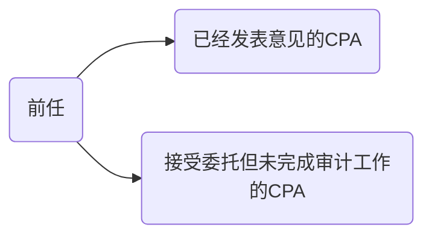
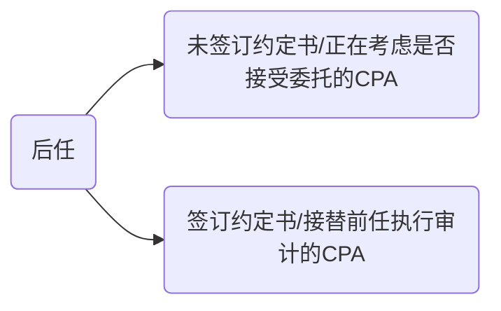
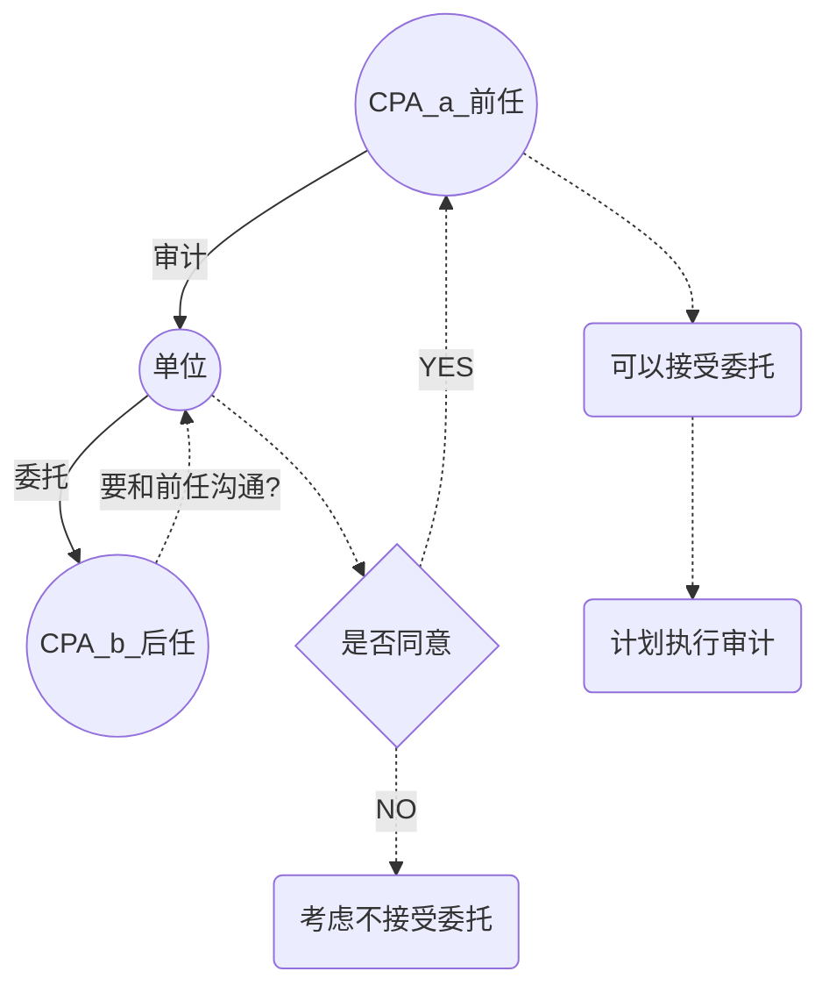

# 前后任

**前任CPA？**

​	已经对被审计单位上期财报进行审计，但被现任接替的其他CPA；接受委托但未完成审计工作，已经或可能与委托人解约的CPA。

*同一家会计师事务所，不同CPA是不属于前后任的*

## 前后任沟通的总体要求

1. 沟通的发起方（在被审计单位同意的前提下，后任主动发起）
2. 沟通的前提（被审计单位的同意）
3. 沟通的方式（可以书面或口头）
4. 对沟通的记录（后任CPA负责记录于底稿）

## 接受委托前的沟通

1. 接受委托前的必要沟通
   1. 沟通目的
      1. 了解被审计单位更换事务所的原因
      2. 确定是否存在不接受委托的事项
   2. 接受委托前的沟通是必要的程序
   3. 评价沟通结果
2. 必要的沟通核心内容
   1. 是否发现管理层的诚信问题
   2. 前任与管理层的分歧
   3. 前任向治理层通报的舞弊，违法，控制缺陷等
   4. 前任认为导致更换的原因
3. 前任的答复
   1. 管理层同意前任充分答复后任，前任应当对后任进行充分答复
   2. 管理层限制前任答复，前任应当向后任表明答复的限制并说明原因
4. 被审计单位不同意沟通的处理
   1. 询问原因，并考虑是否接受委托

## 接受委托后的沟通

> ​	接受委托后的沟通不是必要程序，由CPA自行决定。主要手段是查询前任底稿。

1. 查阅前任CPA的底稿前提（征得被审计单位同意并与前任沟通）
2. 查阅底稿的内容
   1. 前任CPA所在的会计师事务所可自主决定是否允许后任查阅底稿部分内容或摘录部分内容
   2. 如果前任决定向后任提供底稿，同时向被审计单位获取一封确认书
3. 前后任在使用工作底稿达成一致意见
   1. 查阅底稿前，前任向后任获取一份确认函，就底稿使用目的，范围和责任达成一致意见
4. 利用底稿的责任

## 发现前任财报可能错在重大错报的应对

1. 安排三方会谈（提请被审计单位告知前任，必要时举行三方会谈）
2. 无法参与三方会谈的处理
   1. 考虑对当期审计的影响，并出具恰当的审计报告
   2. 是否退出当期的业务

# 知识点地图

