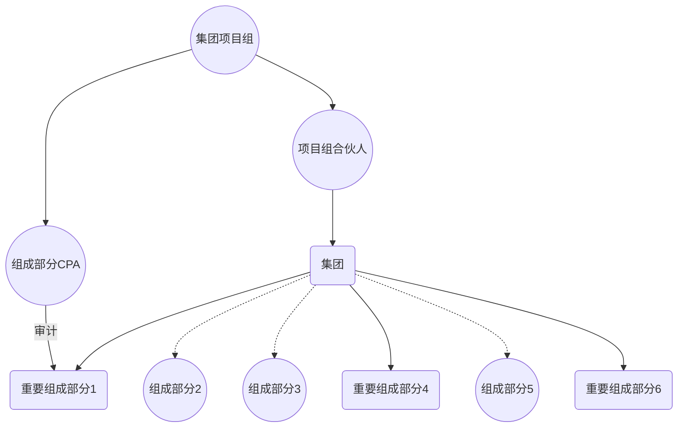

# 有关概念

## 集团

> ​	集团是指所有组成部分构成的整体，并且所有组成部分否要合并成集团财报，集团至少拥有一个以上的组成部分。

## 组成部分

> 组成部分是指一个实体或某一项业务。

## 重要组成部分

>重要组成部分是指集团项目组识别出具有以下特征的组成部分：
>
> 	1. 对于集团财务中大型
>	2. 特别性质或情况，导致集团操作导致重大错报风险的特别风险

## 集团财报

> 包括一个以上的组成部分财报的汇总集团财报。

## 集团审计和集团审计意见

> 集团审计：对集团财报进行的审计
>
> 集团审计意见：对集团财报发表的审计意见

## 集团项目合伙人和集团项目组

> ​	集团合伙人：会计事务所中负责执行集团审计工作，并代表会计师事务所对出具的申报报告上签字的合伙人。
>
> ​	集团项目组：参与集团审计（集团合伙人在内的所有组员）

## 组成部分CPA

> ​	组成部分CPA：基于集团审计目的，按照集团项目组要求，对组成部分执行审计工作的CPA。

## 集团管理层和组成部分管理层

> ​	集团管理层：负债编制集团财报的管理层
>
> ​	组成部分管理层：负债编制组成部分财务信息的管理层。

## 集团层面控制

> 集团管理层设计，执行和维护与集团财报有关的控制。

## 合并过程

1. 通过合并，比率，权益法后成本法，对组成部分财务信息确认计量列报和披露
2. 对没有母公司但处于同一控制下财务信息的汇总。

# 知识点地图

