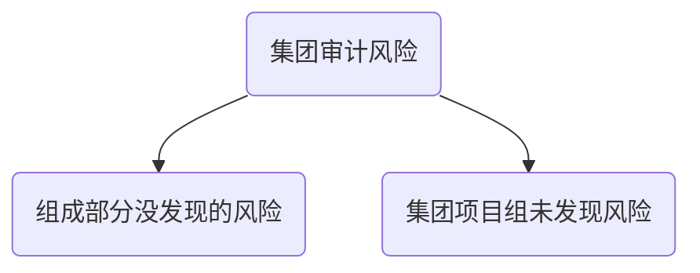

# 了解环境

**为了应对以上两类风险，集团项目组应当：**

1. 在业务承接和保持阶段获取的信息基础上，进一步了解集团和组成部分环境。
2. 了解合并过程，包括管理层向组成部分下达的指令

## 集团管理层下达的指令

1. 运用会计政策
2. 适用集团财报的法定或其他披露要求
3. 报告的时间要求

### 指令的了解方面：

1. 对于报告文件而言，指令是否清晰，实用
2. 指令是否说明了编制基础的要求
3. 指令是否规定遵守适用基础而需要披露的事项
4. 指令是否规定了如何确定合并并调整事项
5. 指令是否规定了组成部分对财务信息的批准程序

## 舞弊

1. 集团管理层对可能存在舞弊风险的评估
2. 集团管理层对舞弊的识别和评估过程
3. 是否有特定组成部分存在舞弊
4. 集团治理层如何监督集团识别和应对舞弊，和管理层为应对舞弊而建立的控制
5. 集团项目组是否获知任何影响组成部分舞弊等管理层的答复

## 集团项目组和组成部分CPA对集团风险的讨论

1. 分享对组成部分及环境的了解
2. 交流有关组成部分或集团经营风险的信息
3. 交流对下列舞弊问题的看法
   1. 集团财报可能如何或何处发生舞弊风险
   2. 集团管理层和组成部分管理层如何编制并隐瞒虚假财报
   3. 组成部分资产可能如何被侵占
4. 识别集团可能倾向或有意操作利润的常用手段
5. 考虑已知，对集团产生影响的内外部因素
6. 考虑集团后组成部分可能凌驾控制之上的风险
7. 考虑集团财报标准是否统一，不统一的话，如何识别和调整
8. 讨论识别出的组成部分舞弊
9. 分享可能违法的信息

## 了解集团和环境的程序

**了解途径：**

1. 在了解集团环境和合并过程中获取信息
2. 从组成部分的CPA获取信息

# 知识点地图

