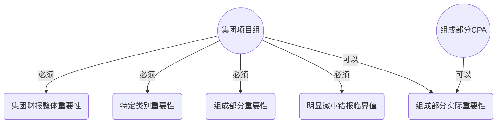

# 重要性

## 集团财报整体重要性（集团项目组）

## 适用于特定类别交易，账户或批量重要性

## 组成部分重要性（集团项目组）

## 明显微小错报临界值（集团项目组）

```mermaid
graph TB
	a((集团项目组))--必须-->a1(集团财报整体重要性)
	a--必须-->a2(特定类别重要性)
	a--必须-->a3(组成部分重要性)
	a--必须-->a4(明显微小错报临界值)
	a--可以-->a5(组成部分实际重要性)
	b((组成部分CPA))--可以-->a5
```

