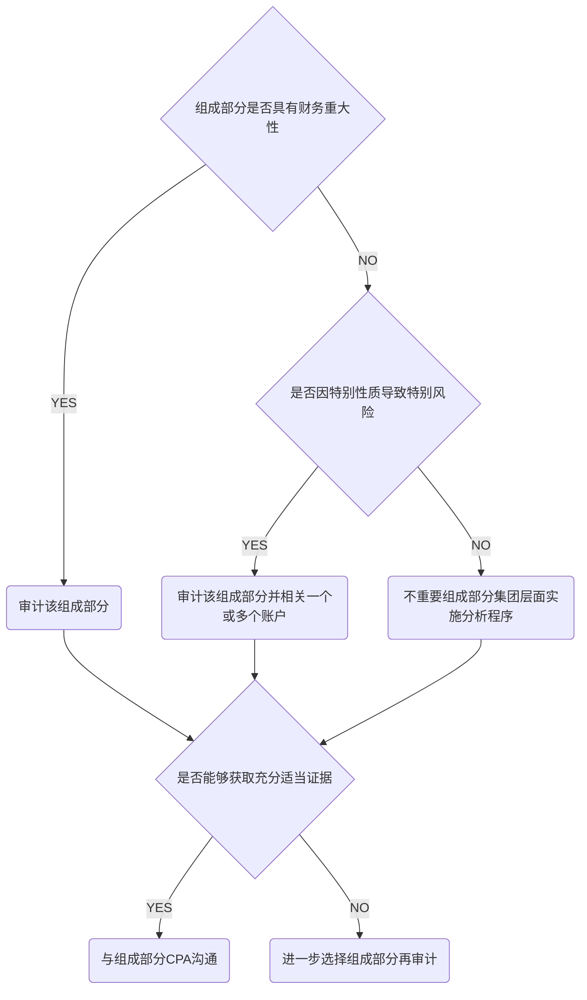

# 风险应对

**集团项目组确定对组成部分执行程序或参与组成部分工作，考虑因素**

1. 组成部分的重要程序
2. 识别出导致集团财报重大风险的特别风险
3. 对集团层面控制设计评价以及是否得到执行
4. 集团项目组对组成CPA的了解

## 对重要组成部分需要执行的工作

**针对特别风险的组成部分，CPA需要执行如下：**

1. 使用组成部分重要性对组成部分信息实施审计
2. 针对可能导致重大特别风险的一个或多个账户实施审计
3. 针对可能导致重大特别风险实施特定的审计程序

## 对不重要组成部分所需执行的工作

集团项目组应当在集团层面实施分析程序。

## 已经执行工作仍不能提供充分适当的证据的处理

1. 使用组成部分重要性对组成部分进行审计
2. 对一个或多个账户实施审计
3. 使用组成部分重要性，对组成部分信息审阅
4. 实施特定程序

**集团项目组选取信息量的考虑因素**

1. 预期就重要组成部分财务信息获取审计证据的程度
2. 组成部分是新设还是收购的
3. 组成部分是否发生重大变化
4. 内审是否对组成部分执行工作
5. 组成部分是否应当使用相同的系统和程序
6. 集团层面控制的有效性
7. 通过集团层面分析程序识别异常波动
8. 与同类组成部分相比，是否具有财务重大性
9. 是否因法律要求需要对组成部分进行审计

## 参与组成部分CPA工作

1. 与组成CPA讨论，对于集团项目组来说重要的活动
2. 与组成CPA讨论由于舞弊导致重大风险的可能性
3. 复核组成CPA识别出导致集团重大错报特别风险的底稿

### 集团项目组参与组成CPA工作，取决于对组成CPA的了解，包括

1. 与组成部分管理层和CPA会谈，获取对部分和环境的了解
2. 复核组成部分CPA总体审计策略和具体审计计划
3. 实施风险评估程序，识别评估组成部分层面的错报风险
4. 设计和实施进一步审计程序
5. 参与组成部分管理层和CPA总结会议
6. 复核组成部分CPA工作底稿

# 知识点地图

