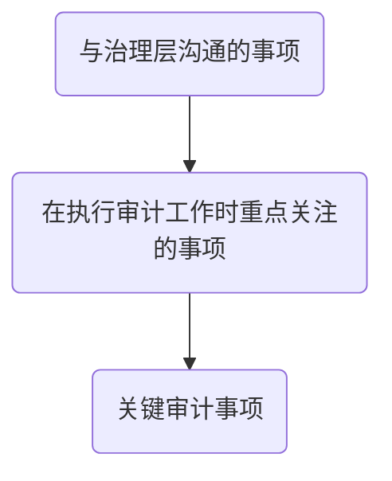

# 关键审计事项

**关键审计事项？**

> 关键审计事项，是指CPA根据职业判断认为对当期财务报表最为重要的事项。
>
> 可以提高已经执行审计工作的透明度，提高报告决策的相关性和有用性。

## 确定关键审计事项决策框架

1. 以“与治理层沟通的事项”为起点选择关键审计事项
2. 从“与治理层沟通事项”中选出“在实行审计工作中重点关注过的事项”
   1. 确认重点关注过的事项考虑：
      1. 评估的重大错报风险较高的领域或识别出特别风险
      2. 与财报中涉及重大管理层判断的领域相关的重大审计判断
      3. 当期重大交易或事项对审计的影响
3. 从“在执行审计工作重点关注过的事项中”选出“最为重要的事项”
   1. 该事项对预期使用者理解财报的整体重要程度
   2. 与该事项相关的会计政策性质或同行其他相比，管理层选择的主观程度
   3. 从定性和定量方面考虑，与该事项相关的舞弊或错误导致的已经更正或未更正的错报性质和重要程度
   4. 为应对该事项所需付出的审计努力性质和程度
      1. 为应对该事项而实施审计程序或评价审计程度结果在多大程度上需要特殊知识技能
      2. 就该事项在项目组外进行咨询性质 
   5. 在实施审计程度，评价实施审计程度结果，获取相关和可靠审计证据以作为发表审计意见的基础时候，CPA遇到困难的性质和严重程度
   6. 识别出的与该事项相关的控制缺陷的严重程度
   7. 该事项是否涉及数项可区分但有相互关联的审计考虑

## 在审计报告中沟通关键审计事项

1. 在审计报告中单设关键审计事项部分
   1. CPA职业判断，对财报审计最为重要的事项
   2. CPA对财报整体发表意见，而不是以关键审计事项发表意见
2. 描述单一关键审计事项
   1. 该事项被认定为审计中最为重要的事项之一
   2. 该事项在审计中如何应对
      1. 审计应对措施或审计方法
      2. 对已经实施的审计程度的简要概述
      3. 实施审计程序的结果
      4. 对该事项作出的主要看法
      5. 描述需要注意：
         1. 不暗示CPA在财报形成审计意见时尚未恰当解决该事项
         2. 将该事项与被审计单位具体情形紧密相扣，避免使用通用标准化语言
         3. 考虑该事项在相关财报披露中如何处理的
         4. 不包含或暗示对财报单一要素发表的意见

## 不在审计报告中沟通关键审计事项情形

> 除非法律法规金子公开披露某事项，或在极其罕见的情况下，若果合理预期审计报告中沟通某事项造成负面后果超过产生的公众利益方面的益处，CPA确定不应再审计报告中沟通该事项。

## 就关键审计事项与治理层沟通

1. CPA确定的关键审计事项
2. 根据被审计单位和业务具体情况，CPA确定不再沟通的关键审计事项

# 知识点地图

