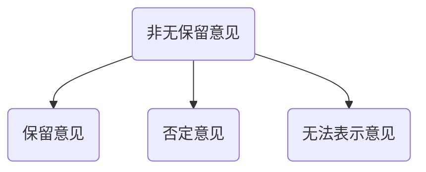

# 非无保留意见

**发表非无保留意见情况：**

1. 得出财报整体存在重大错报结论
   1. 选择会计政策的恰当性
      1. 选择会计政策与使用编制基础不一致
      2. 财报没有按照公允价值反应
   2. 对所选择会计政策运用
      1. 管理层没有按照一贯性选择会计政策
      2. 不当运用所选择的会计政策
   3. 财报披露的恰当性或充分性	
      1. 财报没有包含编制基础所要求的全部披露
      2. 财报没有按照基础编制列报
      3. 财报没有做出必要的披露与公允反映
2. 无法获取充分适当的证据，不能得出财报整体不存在错报的结论
   1. 超出被审计单位的控制情形
   2. 与CPA工作性质或时间安排相关情形
   3. 管理层施加限制的情形
      1. 阻止CPA实施监盘存货
      2. 阻止对特定账户的函证

## 确定非无保留意见的类型

|            | 重大但具有广泛性 | 重大且广泛 |
| ---------- | -------- | ----- |
| 错在重大错报     | 保留       | 否定    |
| 无法获取充分适当证据 | 保留       | 无法表示  |

## 非无保留意见审计报告格式和内容

1. 导致非无保留意见的事项段
   1. 审计报告格式和内容一致性
   2. 量化财务影响
   3. 存在与叙述性披露相关重要错报
   4. 存在与应披露而未披露信息相关错报
   5. 无法获取充分，适当的审计证据
   6. 披露其他事项
2. 审计意见段
   1. 标题
   2. 发表保留意见
   3. 发表否定意见
   4. 发表无法表示意见
3. 非无保留意见对审计报告要素内容的修改
   1. 发表无法表示意见，需要修改
      1. CPA责任按照审计准则规定，对财报执行审计，得出审计报告
      2. 但由于形成无法表示意见的基础部分所述的事项，CPA无法获取充分适当的证据
      3. 申明CPA在独立性和职业道德的责任

# 知识点地图

