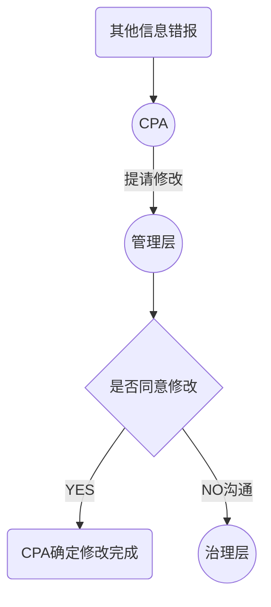

# CPA其他责任

## 获取其他信息

1. 董事会报告
2. 公司董事会，监事会及董建高年度报告
3. 公司治理情况说明
4. 内部控制自我评价报告
   1. 单独行业监督报告
   2. 公司社会责任报告
   3. 可持续发展报告
   4. 多元化和平等报告
   5. 产品责任报告
   6. 劳工法报告

## 阅读并考虑其他信息

1. 财报摘要表格，图表
2. 财报余额，账户进一步细节披露
3. 对财报结果表述

## 当似乎存在重大不一致或其他信息似乎存在重大错报时候的应对

1. 其他信息是否存在重大错报
2. 财报是否存在重大错报
3. CPA对被审计单位及环境了解是否需要更新

## 当CPA认为其他信息存在重大错报的应对

## 当财报存在重大错报或CPA对被审计单位环境需要了解更新应对

## 报告

1. 单独以“其他信息”为标题列报
   1. 对于上市实体，CPA已经获取其他信息
   2. 对于非上市实体，CPA获取部分或全部其他信息
2. 其他信息内容
   1. 管理层对其他信息负责说明
   2. 指明：
      1. CPA与审计报告日前获取的其他信息
      2. 对于上市实体，预期在审计报告日后获取的信息
      3. 说明CPA审计意见未涵盖其他信息，不单独对其他信息发表意见
      4. 描述CPA根据准则要求，对其他信息进行阅读的责任
      5. 如果审计报告日前获取的其他信息，如下两种做法说明：
         1. 说明CPA无任何需要报告的事项
         2. 如果其他信息存在重大错报，需要说明

# 知识点地图

