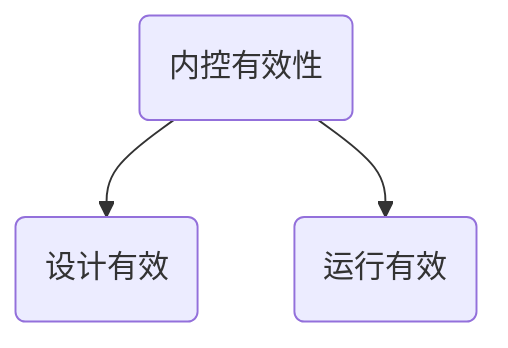

# 内控测试

## 内控有效性

1. 控制在所审计的期间相关时点是如何运行的
2. 控制是否得到一贯执行
3. 控制由谁或以何种方式执行

## 与控制相关的风险

1. 下列因素与某项控制相关的风险
   1. 该项控制防止或发现并纠正错报性质和重要程度
   2. 相关账户，列报认定固有风险
   3. 交易数量和性质是否发生变化，进而可能对该项控制设计或运行有效性不利影响
   4. 相关账户或列报是否曾经出现错报
   5. 企业层面控制有效性
   6. 该项控制性质和执行频率
   7. 该项控制对其控制有效性依赖程度
   8. 执行该项控制或监督该项执行人员专注胜任能力
   9. 该项控制是人工还是自动化
   10. 该项控制复杂程度，以及运行过程中依赖判断程度
2. 其他因素
   1. 以前审计所执行审计程度性质，时间和范围
   2. 以前审计控制测试结果
   3. 自上次审计以来控制流程是否发生变化

## 测试控制有效性程度性质

1. 询问
2. 观察
3. 检查
4. 重新执行

## 控制测试时间安排

为了获取充分适当的证据，CPA应当从一下两个因素平衡：

1. 尽量在接近基准日实施测试
2. 实施测试需要涵盖足够长期间
   1. 基准日之前测试特定控制
   2. 其中获取有关审计证据充分性和适当性
   3. 剩余期间的长短
   4. 其中测试之后，内部控制发生重大变化的可能性
   5. CPA基于对控制的依赖程度减少进一步实质性程度程度
   6. 控制环境

## 控制测试范围

1. 测试人工控制最小样本规模
2. 测试自动化应用控制的最小样本规模
   1. 测试与该应用控制有关的一般控制运行有效性
   2. 确定系统是否发生变动
   3. 确定对交易处理是否使用授权批准软件版本
3. 发现偏差处理
   1. 与所测试控制相关风险评估
   2. 需要获取审计证据
   3. 控制运行有效性结论
      1. 该偏差是如何被发现的
      2. 该偏差是与某一特定地点，流程或应用系统相关，具有广泛影响
      3. 就被审计单位内部政策而言，该控制出现偏差的严重程度
      4. 与控制运行频率相比，偏差发生频率大小

## 知识点地图

