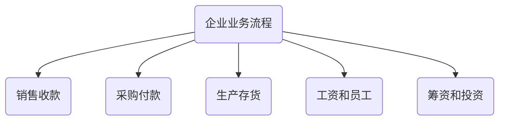
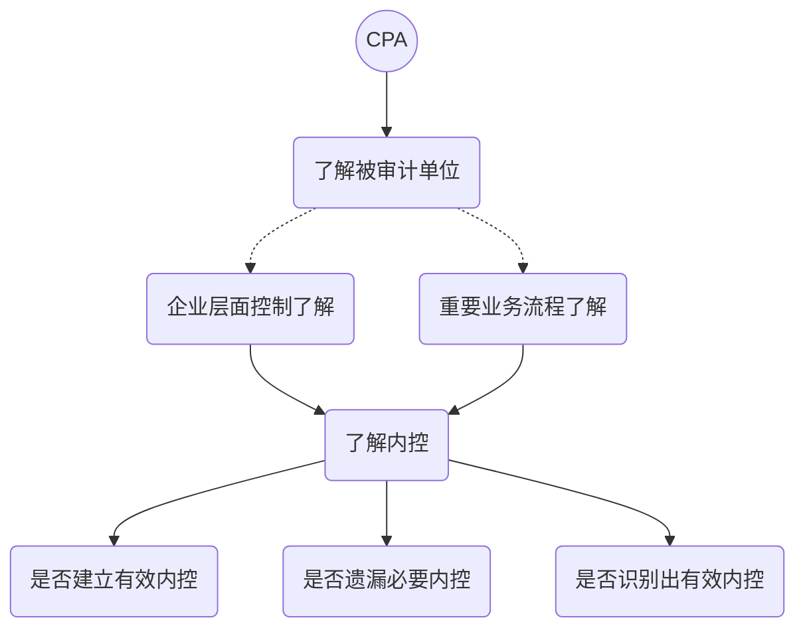

# 交易层面测试

## 了解企业经营活动和业务流程

1. CPA了解业务流程前，需要考虑的事项：
   1. 该业务流程中的交易所影响的重要账户和相关认定
   2. CPA已经识别出的有关重要账户经营风险和重大错报
   3. 交易生成，记录，处理，报告过程相关的信息技术处理系统

## 识别可能发生错报的环节

> CPA需要了解和确认被审计单位应在哪些环节设置控制，以防止或发现重要业务流程可能发生的错报。

1. 为实现某项审计目标而设计问题的数量，取决于下列因素：
   1. 业务流程复杂程度
   2. 业务流程发生错报而未被发现的概率
   3. 是否存在一种具有时效总体控制实现控制的目标

## 识别和了解相关控制

1. 控制的类型
   1. 预防性控制（事前）
   2. 检查性控制（事后）
   3. 主要使用检查手段的情况
      1. 控制所检查的数据是完整和可靠的
      2. 控制对发现错报足够敏感
      3. 发现的所有重大错报都将被纠正
2. 识别和了解方法（询问）

> CPA并不需要了解与每一控制目标相关的所有控制。

## 记录相关控制

# 知识点地图

