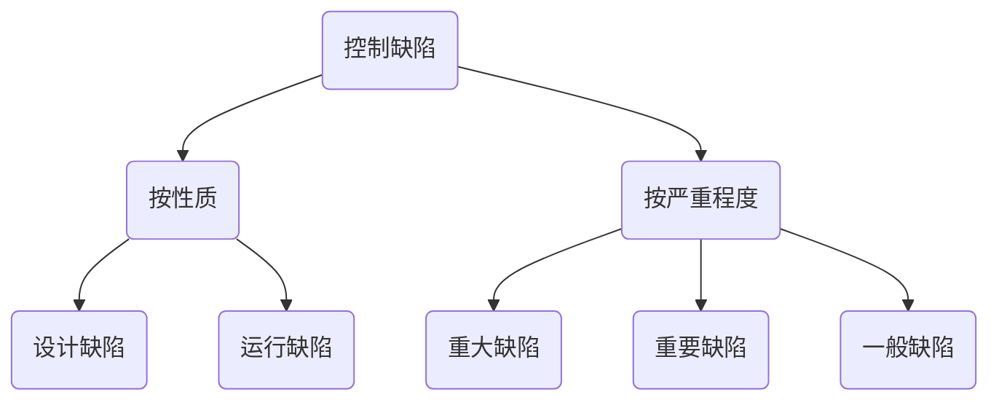
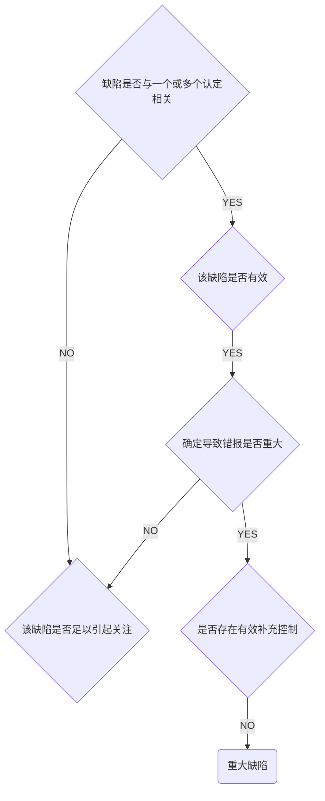

# 内控缺陷评价

## 缺陷分类

## 评价控制缺陷严重程度

1. 控制严重程度取决于：
   1. 控制无效的可能性大小
   2. 控制无效导致错报金额大小
   3. 评价控制无效导致错报考虑因素
      1. 所涉及账户，列报相关认定性质
      2. 相关资产或负债易发生损失舞弊可能性
      3. 确定相关金额所需判断主观程度，负债程度和范围
      4. 控制缺陷之间的相互作用
      5. 控制缺陷在未来可能产生的影响
   4. 评价控制无效导致错报金额考虑因素
      1. 受控制缺陷影响金额总额
      2. 本期或预期未来期间受控制缺陷影响账户交易量

## 内控缺陷整改

# 知识点地图

