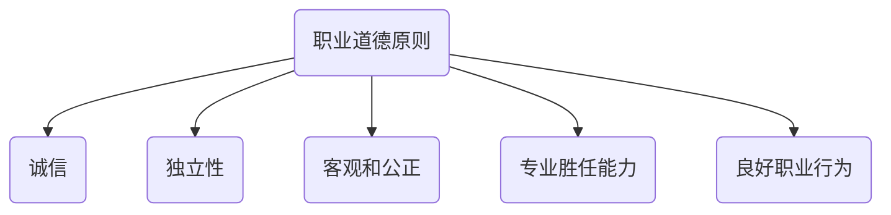
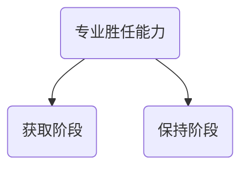

# 原则

## 诚信

1. 含有严重虚假或误导性陈述
2. 含有缺乏充分依据陈述信息
3. 存在遗漏或含糊其辞的信息

## 独立性

> 不受外来力量的控制，支配，按照一定规矩行事

## 客观公正

> 客观：按照实物本来面目去考察，不添加个人的偏见
>
> 公正：公平，正直，不偏袒

## 专业胜任能力和应有关注

## 保密

1. 要求会员不得有下列行为：
   1. 未经客户授权或法律允许，向事务所以外第三方披露所知的涉密信息
   2. 利用所获知的涉密信息为己谋利
2. 会员可以披露涉密信息的情况
   1. 法律允许披露，并且取得客户或单位授权
   2. 根据法律要求，为诉讼等提供证据
   3. 法律允许情况下，在诉讼等维护自己合法权益
   4. 接受CPA协会或监管机构执业质量检查，答复询问和调查
   5. 法律，执业准则和职业道德规范其他情形

## 良好职业行为

1. 夸大宣传提供服务，拥有资质或经验
2. 贬低或无根据比较其他CPA工作

# 知识点地图

