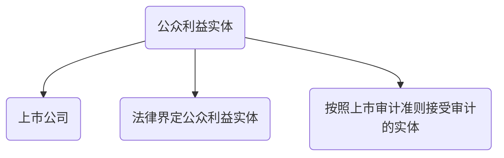

# 基本要求

## 独立性框架

1. 独立性内涵
   1. 实质上独立性（内心状态）
   2. 形式上独立性（外在表现）
2. 框架内涵
   1. 目的：
      1. 识别对独立性不利影响
      2. 评价不利影响严重程度
      3. 必要采取防范措施消除不利

## 网络和网络事务所

1. 定义
   1. 共享收益或分担成本
   2. 共享所有权，控制权或管理权
   3. 共享统一质控政策和程度
   4. 共享统一经营战略
   5. 使用同一品牌
   6. 共享重要专业资源
2. 确定
   1. 旨在通过合作，在各实体之间共享后分担成本，视为网络
   2. 旨在通过合作，在各实体之间共享所有权，控制权或管理权，视为网络
   3. 共享统一质控政策和程度，视为网络
   4. 共享同一经营战略，视为网络
   5. 使用同一品牌，视为网络
   6. 共享重要资源，视为网络
      1. 共享客户资料，收费安排和时间记录信息
      2. 合伙人和员工
      3. 技术部门，负责就鉴证业务特定问题提供咨询
      4. 审计方法或审计手册
      5. 培训课程和设施
      6. 不视为网络情况
         1. 共享资源仅限于审计手册或审计方法
         2. 共享培训资源，但不交流人员，客户资料
         3. 没有一个共有技术部门

## 公众利益实体

## 关联实体

1. 关联实体存在下列任意关系：
   1. 能够对客户施加直接或间接控制的实体
   2. 在客户内拥有直接经济利益实体，并对客户具有重大影响
   3. 收到客户直接或间接控制实体
   4. 客户拥有直接经济利益实体，并且客户能够对其实施重大影响
   5. 姐妹实体

## 治理层

CPA根据职业判断，定期就可能影响独立性关系和事项与治理层沟通，使治理层能够：

1. 考虑事务所在识别和评价独立性不利影响判断是否正确
2. 考虑事务所应对不利措施是否适当
3. 确定是否有必要采取适当措施

## 工作记录

## 业务期间

$$
保持独立性区间 = 财报涵盖期 + 审计业务期
$$

当CPA接受委托，在独立区间内执行鉴证业务，事务所应当确定一下因素是否影响独立性：

1. 在财报涵盖期后之后，接受审计业务前，与审计客户之间存在经济利益
2. 以往向审计客户提供服务

### 措施

1. 不允许提供非鉴证服务人员担任审计项目组组员
2. 必要时由其他CPA复核审计和非鉴证工作
3. 有其他事务所评价非鉴证业务成果

## 合并与收购

1. 不利影响严重程度影响因素：
   1. 利益或关系性质和重要程度
   2. 审计客户与关联实体性质和重要程度
   3. 合理终止该利益关系需要时间
2. 治理层要求继续执行审计业务，事务所应当同时满足一下条件：
   1. 在合并或收购生效日起6个月，尽快终止目前存在利益关系
   2. 存在利益或人员不得作为项目组组员，不得复核
   3. 拟财务适当过度性措施并就此与治理层讨论
      1. 必要有项目组外CPA复核工作
      2. 由其他事务所再次执行项目质控复核
      3. 由其他事务所评价非鉴证业务结果

# 知识点地图

