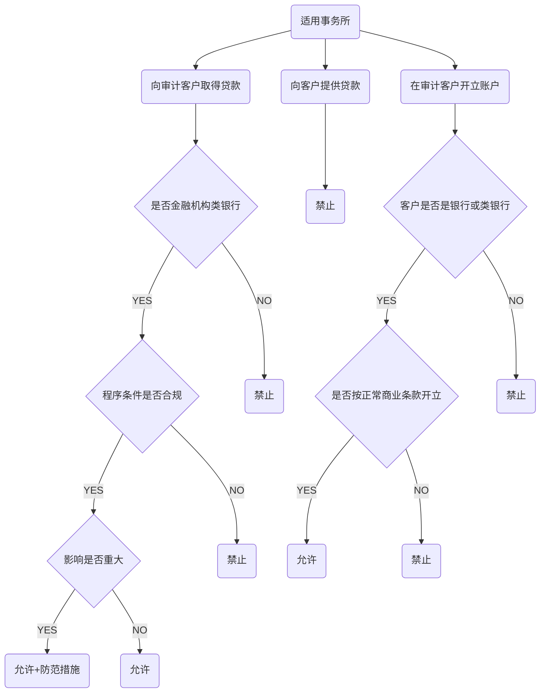
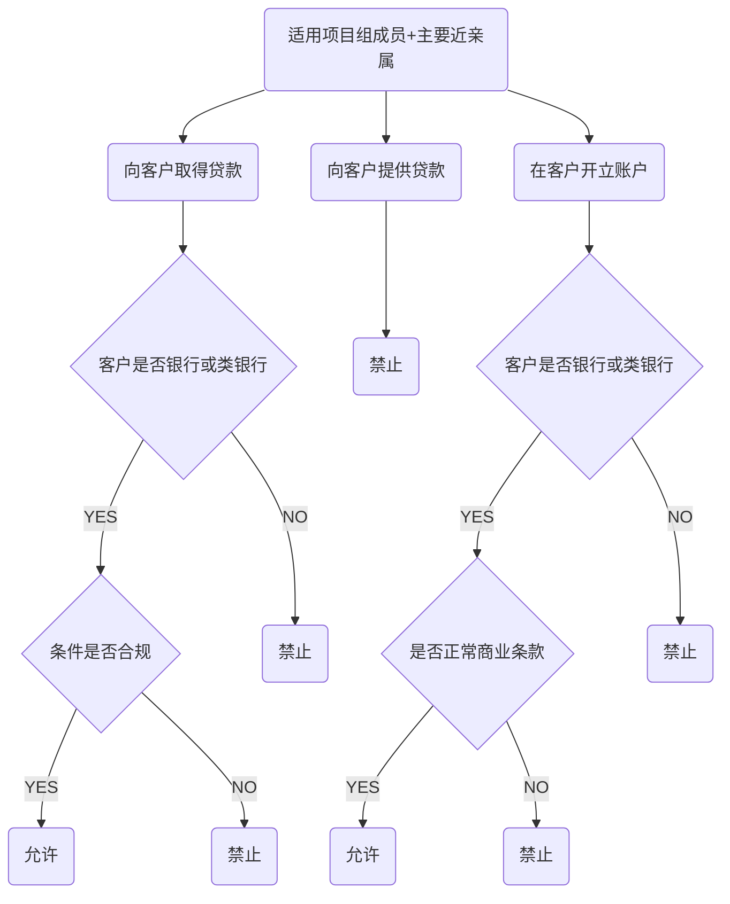

# 贷款担保

## 贷款和担保

1. 从银行或类银行金融机构审计客户取得贷款和担保
2. 从不属于银行和类银行金融机构审计客户取得贷款和担保
3. 向审计客户提供贷款和担保
4. 在审计客户开立存款或交易账户

## 商业关系

1. 种类和措施
   1. 与客户共同开办企业拥有经济利益
   2. 事务所和客户服务捆绑销售
   3. 事务所和客户间相互推广对方
2. 与审计客户或利益相关者一同在某股东人数有线实体存在利益
   1. 当同时满足下列条件，这种商业关系不会对独立性产生不利影响
      1. 这种商业关系对事务所+客户+组成员及主要近亲属均不重要
      2. 该经济利益对一个或多个投资者并不重要
      3. 该经济利益不能使一个或多个投资者控制实体
3. 从审计客户购买商品或服务
   1. 措施
      1. 取消交易或降低交易规模
      2. 将相关审计项目组成员调离项目组

## 家庭和私人关系

1. 审计项目组成员主要近亲属在重要职位

2. 审计项目组成员主要近亲属可以对客户财报施加重大影响

   1. 不利影响程度，取决于：
      1. 主要近亲属在客户中的职位
      2. 该成员在项目组角色

   3. 措施
      1. 调离该成员
      2. 合理安排审计项目组成员职责，使之不涉及主要近亲属职责范围

3. 项目组成员其他近亲属对客户施加重大影响

   1. 不利影响程度取决于：
      1. 审计项目组成员与其他近亲属关系
      2. 其他近亲属在客户中的职位
      3. 该成员在审计项目组角色
   2. 措施
      1. 调离
      2. 合理安排

4. 项目组成员和客户重要职业关系密切

   1. 不利影响程度取决于：
      1. 该员工与审计项目组成员关系
      2. 该员工在客户中的职位
      3. 该成员在审计项目组中的角色
   2. 措施
      1. 调离
      2. 合理安排

5. 非项目组成员和客户重要职员存在家庭或个人关系

   1. 不利影响程度取决于：
      1. 关系程度
      2. 关系人对项目组相互影响
      3. 关系人在事务所角色
      4. 董事，高管或特定人员在客户中的职位
   2. 措施
      1. 合理安排职责，减少相互影响
      2. 由项目组外CPA复核审计工作

# 知识点地图

