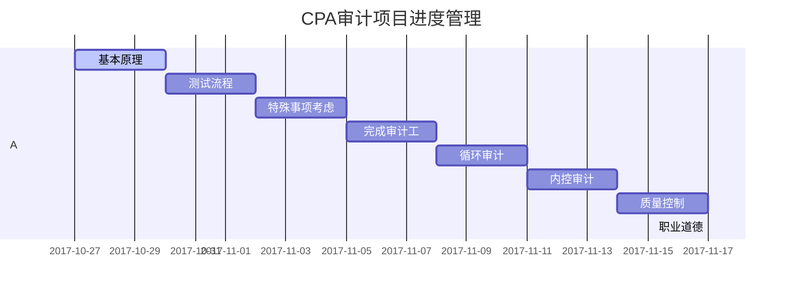

 

# 说明

+ 1：目的：本次成书的目的是对CPA审计知识的再度梳理并于自身的逻辑结构，本次初步分两个阶段：

  + 1.1：书籍知识点的重述
  + 1.2：将知识点以图的方式建立“局部地图”——>“城市地图“——>”全局知识地图“

+ 2：方法：着重知识点的关键点的重述，建立”逻辑地图“

+ 3：项目进度管理：*2017-10-27——2017-11-20*

  + 3.1：基本原理[3d]
  + 3.2：测试流程[3d]
  + 3.3：特殊事项考虑[3d]
  + 3.4：完成审计工作[3d]
  + 3.5：循环审计[3d]
  + 3.6：内控审计[3d]
  + 3.7：质量控制[3d]
  + 3.8：职业道德[3d]

